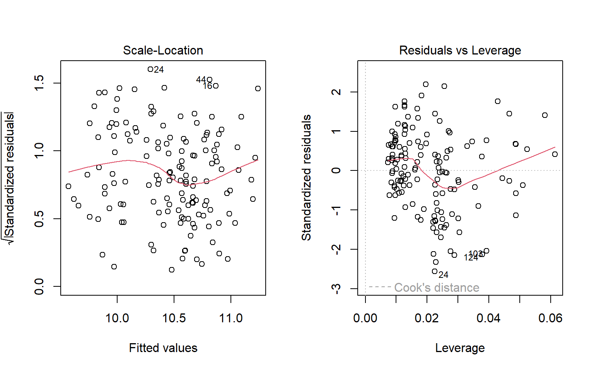
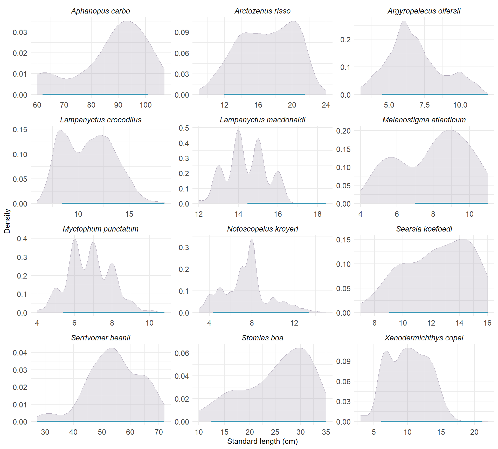

# 1. Relationships between size distribution and depth

## Community level
- Bigger fish at depth? 

::: {.cell}

```{.r .cell-code}
#Library
library(tidyr)
library(dplyr)
library(ggplot2)

# Catch data EHVOE 2002-2019 ----
data_evhoe2002_2019 <- utils::read.csv(here::here("data", "trawling_data_evhoe_2002_2019.csv"), sep = ";", header = T,dec = ".")

# prepare data for EVHOE 2002-20219
size_data_2002_2019 <- data_evhoe2002_2019%>%
  # divide by 10 when size in mm and not cm 
  mutate(size= case_when(Unite_Taille =="mm" ~Taille/10,
                         Unite_Taille =="cm" ~Taille))%>%
  select(Code_Station, Nom_Scientifique, Annee, size, Nbr, trawling_depth)%>%
  na.omit()%>%
  # selection of species of interest (also sampled for isotopy)
  filter(Nom_Scientifique%in% c("Stomias boa",
                                "Lampanyctus crocodilus",
                                "Myctophum punctatum",
                                "Aphanopus carbo",
                                "Melanostigma atlanticum",
                                "Serrivomer beanii",
                                "Argyropelecus olfersii",
                                "Lampanyctus macdonaldi",
                                "Searsia koefoedi",
                                "Notoscopelus kroyeri",
                                "Xenodermichthys copei",
                                "Arctozenus risso"))%>%
  tidyr::uncount(Nbr)

# Catch data EHVOE 2002-2019 ----
data_evhoe_2021 <- utils::read.csv(here::here("data", "trawling_data_evhoe_2021.csv"), sep = ";", header = T,dec = ".")

# prepare data for EVHOE 2021
size_data_2021 <- data_evhoe_2021%>%
  # divide by 10 when size in mm and not cm 
  mutate(size= case_when(Unite_Taille =="mm" ~Taille/10,
                         Unite_Taille =="cm" ~Taille))%>%
  select(Code_Station, Nom_Scientifique, Annee, size, Nbr)%>%
  na.omit()%>%
  # selection of mesopelagic trawls 
  filter(Code_Station%in% c("Z0524", "Z0518", "Z0512", "Z0508", 
                            "Z0503", "Z0497", "Z0492"))%>%
  # selection of species of interest (also sampled for isotopy)
  filter(Nom_Scientifique%in% c("Stomias boa",
                                "Lampanyctus crocodilus",
                                "Myctophum punctatum",
                                "Aphanopus carbo",
                                "Melanostigma atlanticum",
                                "Serrivomer beanii",
                                "Argyropelecus olfersii",
                                "Lampanyctus macdonaldi",
                                "Searsia koefoedi",
                                "Notoscopelus kroyeri",
                                "Xenodermichthys copei",
                                "Arctozenus risso"))%>%
  tidyr::uncount(Nbr)%>%
  # assign depth to a station 
  mutate(trawling_depth= case_when(Code_Station %in% c("Z0508") ~25,
                                   Code_Station %in% c("Z0492") ~370,
                                   Code_Station%in% c("Z0512") ~555,
                                   Code_Station %in% c("Z0503") ~715,
                                   Code_Station %in% c("Z0518") ~1000,
                                   Code_Station %in% c("Z0524") ~1010,
                                   Code_Station %in% c("Z0497") ~1335))
  
# merge dataframes 
trawling_dataset <- rbind(size_data_2002_2019, size_data_2021)%>%
  # add column with depth layer (cf 1st paper)
  mutate(depth_layer= case_when(between(trawling_depth, 0, 174) ~"Epipelagic",
                               between(trawling_depth, 175, 699)~"Upper mesopelagic",
                               between(trawling_depth, 700, 999)~"Lower mesopelagic",
                               between(trawling_depth, 1000, 2000)~"Bathypelagic"))%>%
  mutate(across(depth_layer, factor, levels = c("Epipelagic", "Upper mesopelagic",
                                                "Lower mesopelagic", "Bathypelagic")))%>%
  rename("species"="Nom_Scientifique")
 
# median size in each depth layer 
median_size_data <- trawling_dataset%>%
  group_by(depth_layer)%>%
  summarise(median_size =median(size))%>%
  mutate(across(depth_layer, factor, levels = c("Epipelagic", "Upper mesopelagic",
                                                "Lower mesopelagic", "Bathypelagic")))

ggplot(trawling_dataset, aes(x=size)) +
  geom_density(alpha=0.5, linewidth=0.6, bw=0.2, aes(col=depth_layer, fill= depth_layer))+
  scale_fill_manual(values = c("#93C3FF", "#6799D3","#3A72A8", "#002A58"))+
  scale_color_manual(values = c("#93C3FF", "#6799D3","#3A72A8", "#002A58"))+
  facet_wrap(~depth_layer, ncol=1, scales = "free_y") +
  theme_minimal()+
  scale_x_continuous(trans = 'log2') +
  theme(strip.text.x = element_text(size=9,face="bold"),
        strip.text.y = element_text(size=9),
        axis.title = element_text(size=9),
        axis.text =  element_text(size=9, color= "grey50"),
        panel.background=element_rect(color="white"),
        plot.background = element_rect(color = "white"),
        legend.title = element_text(size=9),
        legend.text = element_text(size=9))+
  guides(fill="none",col="none")+
  xlab("Log2 total length (cm)")+
  geom_vline(data =median_size_data, aes(xintercept = median_size, color=depth_layer),
             linewidth=0.6, linetype="dashed")
```

::: {.cell-output-display}
{width=672}
:::

```{.r .cell-code}
#store the plot in the "figures" file in high resolution 
ggsave("density_plot_community.png", path = "figures", dpi = 700, height = 6, width = 6)
```
:::


### Linear relationship

::: {.cell}

```{.r .cell-code}
broom::tidy(lm(size~trawling_depth, data = trawling_dataset))
```

::: {.cell-output .cell-output-stdout}
```
# A tibble: 2 × 5
  term           estimate std.error statistic   p.value
  <chr>             <dbl>     <dbl>     <dbl>     <dbl>
1 (Intercept)     8.91     0.398        22.4  5.04e-105
2 trawling_depth  0.00347  0.000473      7.34 2.61e- 13
```
:::
:::


## Species level
### Linear relationships

::: {.cell}

```{.r .cell-code}
linar_regression_size_depth_sp <- trawling_dataset %>%
  group_by(species)%>%
  do(broom::tidy(lm(size~trawling_depth, .)))

htmltools::tagList(DT::datatable(linar_regression_size_depth_sp))
```

::: {.cell-output-display}

```{=html}
<div class="datatables html-widget html-fill-item-overflow-hidden html-fill-item" id="htmlwidget-2d12ee5015bac486d27d" style="width:100%;height:auto;"></div>
<script type="application/json" data-for="htmlwidget-2d12ee5015bac486d27d">{"x":{"filter":"none","vertical":false,"data":[["1","2","3","4","5","6","7","8","9","10","11","12","13","14","15","16","17","18","19","20","21","22","23","24"],["Aphanopus carbo","Aphanopus carbo","Arctozenus risso","Arctozenus risso","Argyropelecus olfersii","Argyropelecus olfersii","Lampanyctus crocodilus","Lampanyctus crocodilus","Lampanyctus macdonaldi","Lampanyctus macdonaldi","Melanostigma atlanticum","Melanostigma atlanticum","Myctophum punctatum","Myctophum punctatum","Notoscopelus kroyeri","Notoscopelus kroyeri","Searsia koefoedi","Searsia koefoedi","Serrivomer beanii","Serrivomer beanii","Stomias boa","Stomias boa","Xenodermichthys copei","Xenodermichthys copei"],["(Intercept)","trawling_depth","(Intercept)","trawling_depth","(Intercept)","trawling_depth","(Intercept)","trawling_depth","(Intercept)","trawling_depth","(Intercept)","trawling_depth","(Intercept)","trawling_depth","(Intercept)","trawling_depth","(Intercept)","trawling_depth","(Intercept)","trawling_depth","(Intercept)","trawling_depth","(Intercept)","trawling_depth"],[75.65064119544192,0.01370695881632935,17.54311139275014,-0.0007224227811610187,6.697369755081787,0.0001158753803900725,9.598775571447689,0.001779828115848952,14.11741651219076,0.0001720555300612629,3.546902115752608,0.004932043185613917,7.060133692149038,-0.0003342820754280245,7.516925407780472,-3.042751240364229e-05,12.21352778750001,0.0002506664565012383,53.9224039544682,0.0005985113608859866,25.08595780068441,0.0001673794508713267,9.093704548449818,0.001440607770320578],[8.32435081254348,0.008988180306456695,0.504842354738093,0.000595238811614125,0.2913290510210676,0.0003052793758631821,0.1914723536862743,0.0002248587827694627,0.561934035059011,0.0003311633131802674,0.8667898160886016,0.0009475065966336187,0.1394456764024787,0.0001621044366291953,0.1963391852957233,0.0002716382791218377,1.247045676219372,0.001438906500179791,3.519146986810279,0.003509419791308328,1.994554143549267,0.002203699115688329,0.3151675359860304,0.0004283901931440127],[9.087872784199384,1.524998203082654,34.74968220891712,-1.21366881168586,22.98902128575383,0.3795715975323689,50.13139174742269,7.915315087664275,25.1229070164939,0.519548884835577,4.091997909894745,5.205286383373895,50.62999351641096,-2.06214020034921,38.28540592372627,-0.1120148180220015,9.793969876490307,0.174206215949346,15.32257793055213,0.170544248473295,12.5772257834247,0.07595385852802572,28.85355726756353,3.362840217577732],[5.818941730757775e-11,0.1357626782923842,1.844219538440142e-96,0.2260477042443258,2.045601470120994e-58,0.7046602227930043,2.026187992349819e-296,5.582656426132565e-15,9.437005769365102e-37,0.6050170533388755,6.858412165085037e-05,6.064314533679442e-07,8.484325247595632e-175,0.03984789536775898,3.043055983194004e-161,0.9108502126873712,1.729001676816215e-14,0.8622366585594283,1.392593268157294e-22,0.8651465501761531,1.359658222830485e-18,0.9397043687560058,8.025781432865185e-136,0.0007988163604999674]],"container":"<table class=\"display\">\n  <thead>\n    <tr>\n      <th> <\/th>\n      <th>species<\/th>\n      <th>term<\/th>\n      <th>estimate<\/th>\n      <th>std.error<\/th>\n      <th>statistic<\/th>\n      <th>p.value<\/th>\n    <\/tr>\n  <\/thead>\n<\/table>","options":{"columnDefs":[{"className":"dt-right","targets":[3,4,5,6]},{"orderable":false,"targets":0}],"order":[],"autoWidth":false,"orderClasses":false}},"evals":[],"jsHooks":[]}</script>
```

:::
:::


### Density plot for significant relationships 

::: {.cell}

```{.r .cell-code}
# selection of species with a significant size-depth relationship 
trawling_dataset_significant <- filter(trawling_dataset, 
                                    species %in% c("Lampanyctus crocodilus","Melanostigma atlanticum",
                                                   "Xenodermichthys copei","Myctophum punctatum"))

trawling_dataset_significant$species <- factor(trawling_dataset_significant$species,
                                    levels = c("Lampanyctus crocodilus",
                                             "Melanostigma atlanticum",
                                             "Xenodermichthys copei",
                                             "Myctophum punctatum"))
    

median_size_species <- trawling_dataset_significant%>%
  group_by(species, depth_layer)%>%
  summarise(median_size_sp= median(size))

ggplot(trawling_dataset_significant, aes(x=size)) +
  geom_density(alpha=0.3, linewidth=0.5, adjust= 2, aes(fill= depth_layer, col= depth_layer))+
  scale_fill_manual(values = c("#93C3FF", "#6799D3","#3A72A8", "#002A58"))+
  scale_color_manual(values = c("#93C3FF", "#6799D3","#3A72A8", "#002A58"))+
  facet_grid(depth_layer~species, scale="free")+
  theme_minimal()+
  theme(strip.text.x = element_text(size=12,face="italic"),
        strip.text.y = element_text(size=11),
        axis.title = element_text(size=13),
        axis.text =  element_text(size=10, color= "grey50"),
        panel.background=element_rect(color="white"),
        plot.background = element_rect(color = "white"),
        legend.title = element_text(size=10),
        legend.text = element_text(size=10))+
  guides(fill="none",col="none")+
  xlab("Total length (cm)")+
  geom_vline(data =median_size_species, aes(xintercept = median_size_sp, color=depth_layer), 
             linewidth=0.6, linetype="dashed")
```

::: {.cell-output-display}
{width=1248}
:::

```{.r .cell-code}
#store the plot in the "figures" file in high resolution 
ggsave("density_plot_species.png", path = "figures", dpi = 700, height = 7, width = 9)
```
:::


# 2. $\delta$<sup>15</sup>N-size relationships

## At community level

::: {.cell}

```{.r .cell-code}
ontogeny_data <- utils::read.csv(here::here("data", "ontogeny_isotopy_data.csv"), sep = ";", header = T,dec = ",")%>%
  mutate(species= gsub("_"," ", species))

ggplot(ontogeny_data , aes(x=size, y=d15N_muscle_untreated))+
  geom_point (alpha=0.4, size=1) + 
  geom_smooth(method=lm, se=T, alpha=0.2, col= alpha("darkblue",0.7)) + 
  ggpmisc::stat_poly_eq(formula = y ~ x, 
                        aes(label = paste(..eq.label.., ..rr.label.., ..p.value.label.. 
                                          , ..n.label..,sep = "*`,`~")),
                        parse = TRUE,
                        size=4,
                        label.x.npc = "right",
                        label.y.npc = "bottom",
                        vstep = -0.0005)+ 
  scale_x_continuous(trans = 'log2') +
  xlab(bquote(Log[2]~"standard length (cm)"))+
  ylab(expression({delta}^15*N~'\u2030'))+
  ylim(c(7, 14))+
  guides(fill="none")+
  theme_minimal()+
  theme(strip.text.x = element_text(size=12,face="italic"),
        axis.title = element_text(size=12),
        axis.text =  element_text(size=12),
        plot.background = element_rect(colour = "white"))
```

::: {.cell-output-display}
{width=672}
:::

```{.r .cell-code}
#store the plot in the "figures" file in high resolution 
ggsave("d15n_size_community.png", path = "figures", dpi = 700)
```
:::


## At species level
### Data summary

::: {.cell}

```{.r .cell-code}
data_sum <- ontogeny_data%>%
  group_by(species)%>%
  summarise(range_size= max(size)-min(size),
            min_size=min(size),
            max_size=max(size),
            mean_size=mean(size),
            mean_d15n=mean(d15N_muscle_untreated),
            range_depth= max(trawling_depth)- min(trawling_depth))%>%
   mutate(across(where(is.numeric), round, 2))

htmltools::tagList(DT::datatable(data_sum))
```

::: {.cell-output-display}

```{=html}
<div class="datatables html-widget html-fill-item-overflow-hidden html-fill-item" id="htmlwidget-d1f0d367926f1d790e56" style="width:100%;height:auto;"></div>
<script type="application/json" data-for="htmlwidget-d1f0d367926f1d790e56">{"x":{"filter":"none","vertical":false,"data":[["1","2","3","4","5","6","7","8","9","10","11","12"],["Aphanopus carbo","Arctozenus risso","Argyropelecus olfersii","Lampanyctus crocodilus","Lampanyctus macdonaldi","Melanostigma atlanticum","Myctophum punctatum","Notoscopelus kroyeri","Searsia koefoedi","Serrivomer beanii","Stomias boa","Xenodermichthys copei"],[37,9.5,6.7,8.300000000000001,3.3,4,4,8.1,6,45,21.8,13.9],[59,11,3.3,6.5,11.5,7,5,3.6,8.5,26.7,11.8,5.6],[96,20.5,10,14.8,14.8,11,9,11.7,14.5,71.7,33.6,19.5],[77.33,16.48,6.3,10.95,13.13,9.65,6.73,7.86,11.69,55.36,23.8,11.78],[12.36,10.53,10.18,10.46,11.54,11.21,9.99,11.18,11.8,9.49,11.61,9.83],[30,409,963,1229,666,278,1309,755,247,618,100,963]],"container":"<table class=\"display\">\n  <thead>\n    <tr>\n      <th> <\/th>\n      <th>species<\/th>\n      <th>range_size<\/th>\n      <th>min_size<\/th>\n      <th>max_size<\/th>\n      <th>mean_size<\/th>\n      <th>mean_d15n<\/th>\n      <th>range_depth<\/th>\n    <\/tr>\n  <\/thead>\n<\/table>","options":{"columnDefs":[{"className":"dt-right","targets":[2,3,4,5,6,7]},{"orderable":false,"targets":0}],"order":[],"autoWidth":false,"orderClasses":false}},"evals":[],"jsHooks":[]}</script>
```

:::
:::


-  __A__: significant relationships 
-  __B__: non-significant relationships 
-  __Coefficient of variation__: The dispersion of the $\delta$<sup>15</sup>N values is not the same between the species having shown non-significant $\delta$<sup>15</sup>N-size relationships: *X. copei* presents a strong dispersion of its values (CV = 6.57) contrary to the values of *N. kroyeri* which remain relatively stable with the size of its individuals (CV = 2.15)
-   Do these differences translate into differences in their feeding strategies?

### Linear relationships 

::: {.cell}

```{.r .cell-code}
# Selection of species presenting significant d15N-size relationship
ontogeny_significant <- filter(ontogeny_data,
                               species %in% c("Lampanyctus crocodilus", "Aphanopus carbo",
                                              "Melanostigma atlanticum", "Serrivomer beanii",
                                              "Stomias boa", "Myctophum punctatum","Arctozenus risso"))
# Order species
ontogeny_significant$species <- factor(ontogeny_significant$species,
                               levels = c("Myctophum punctatum",
                                          "Melanostigma atlanticum",
                                          "Lampanyctus crocodilus",
                                          "Stomias boa",
                                          "Serrivomer beanii",
                                          "Aphanopus carbo",
                                          "Arctozenus risso"))

plot_significant <- ggplot(ontogeny_significant, aes(x=size, y=d15N_muscle_untreated))+
  geom_point (alpha=0.4, col="black") + 
  geom_smooth(method=lm, se=T, alpha=0.2, col= alpha("darkblue",0.7)) +
  facet_wrap(~species, scale="free_x", ncol=3)+ 
  ggpmisc::stat_poly_eq(formula = y ~ x, 
                        aes(label = paste(..eq.label.., ..rr.label.., ..p.value.label.. 
                                          , ..n.label..,sep = "*`,`~")),
                        parse = TRUE,
                        size=3.38,
                        label.x.npc = "right",
                        label.y.npc = "bottom",
                        vstep = -0.0005)+ 
  xlab("")+
  ylab(expression({delta}^15*N~'\u2030'))+
  ylim(c(7,13))+
  guides(color="none", fill="none")+
  theme_minimal()+
  theme(strip.text.x = element_text(size=15,face="italic"),
        plot.background = element_rect(colour = "white"),
        axis.title = element_text(size=14),
        axis.text =  element_text(size=13))

# Selection of species presenting non-significant d15N-size relationship
ontogeny_non_significant <- filter(ontogeny_data,
                                   species %in% c("Argyropelecus olfersii", "Lampanyctus macdonaldi",
                                                  "Searsia koefoedi", "Notoscopelus kroyeri",
                                                  "Xenodermichthys copei"))

#order species 
ontogeny_non_significant$species <- factor(ontogeny_non_significant$species,
                                           levels = c("Xenodermichthys copei",
                                                      "Searsia koefoedi",
                                                      "Argyropelecus olfersii",
                                                      "Lampanyctus macdonaldi",
                                                      "Notoscopelus kroyeri"))

# function to calculate coefficient of variation 
cv <- function(x){
  (sd(x)/mean(x))*100
}
coeff_var <- aggregate(d15N_muscle_untreated ~ species, 
                       data = ontogeny_non_significant,
                       FUN = cv)
coeff_var$d15N_muscle_untreated <-round(coeff_var$d15N_muscle_untreated, digits = 2)


plot_non_significant <- ggplot(ontogeny_non_significant, aes(x=size, y=d15N_muscle_untreated))+
  geom_point (alpha=0.4, col="black") + 
  facet_wrap(~species, scale="free_x", ncol=3, nrow = 3)+ 
  ggpmisc::stat_poly_eq(formula = y ~ x, 
                        aes(label = paste( ..n.label..,sep = "*`,`~")),
                        parse = TRUE,
                        size=4,
                        label.x.npc = "right",
                        label.y.npc = "bottom",
                        vstep = -0.0005)+ 
  xlab("Standard Length (cm)")+
  ylab(expression({delta}^15*N~'\u2030'))+
  ylim(c(7, 14))+
  guides(color="none", fill="none")+
  theme_minimal()+
  theme(strip.text.x = element_text(size=15,face="italic"),
        axis.title = element_text(size=14),
        plot.background = element_rect(colour = "white"),
        axis.text =  element_text(size=13))+
  geom_text(coeff_var, mapping = aes(x = -Inf, y = -Inf, label = paste("CV = ", d15N_muscle_untreated, sep = "")),
            hjust = -0.2, vjust = -0.8, size = 4)

# Combine the two plot 
ggpubr::ggarrange(plot_significant, plot_non_significant, ncol=1, labels = c("A", "B"),
                  heights = c(2, 1.25))
```

::: {.cell-output-display}
{width=960}
:::

```{.r .cell-code}
#store the plot in the "figures" file in high resolution 
ggsave("d15n_size_sp.png", path = "figures", dpi = 700, height = 13, width = 10)
```
:::


# 3. Variation partitionning

-   At the species level, is it the sampling depth or the size of the individuals that most influences the values in $\delta$<sup>15</sup>N?
-  To test the significance of the influence of each variable (depth and size) on \(\delta\)$^{15}$N values an ANOVA-type permutation test was performed for each model (anova.cca function)
-  Since the third fraction (depth and size) is not the result of an RDA, it cannot be tested for significance.


::: {.cell}

```{.r .cell-code}
# S. boa and A. carbo not considered in these analyses due to small depth range
varpart_data <- ontogeny_data%>%
  filter(!species%in%c("Stomias boa", "Aphanopus carbo"))

# List of species names
species_list <- unique(varpart_data$species)

# Initialize an empty list to store the results
result_list <- list()

# Initialize an empty data frame to store indfract values (variance explained by each variable)
indfract_df <- data.frame(species = character(0), indfract = numeric(0), variable=character(0))

# Loop through each species
for (species_name in species_list) {
  
  # Filter the data for the current species
  species_data <- varpart_data %>%
    filter(species == species_name)
  
  # Perform variation partitioning analysis
  species_part <- vegan::varpart(species_data$d15N_muscle_untreated,
                                 ~trawling_depth, ~size, data = species_data)
  
  # Create the specified plot for the current species
  plot <- plot(species_part,
               Xnames = c("Depth", "size"), # name the partitions
               bg = c("#072AC8", "#0B5345"), alpha = 100, # colour the circles
               digits = 2, # only show 2 digits
               cex = 1.4)
  
  # Add a title to the plot
  title(main = paste("Variation Partitioning for", species_name))
  
  # Perform the significance testing
  rda1 <- vegan::rda(species_data$d15N_muscle_untreated, species_data$trawling_depth, species_data$size)
  rda2 <- vegan::rda(species_data$d15N_muscle_untreated, species_data$size, species_data$trawling_depth)
  anova1 <- vegan::anova.cca(rda1)
  anova2 <- vegan::anova.cca(rda2)
  
  # Store the results, the plot, and the significance testing in the list
  result_list[[species_name]] <- list(varpart_results = species_part, varpart_plot = plot,
                                      anova_depth_size = anova1, anova_size_depth = anova2)
  
  # Extract and store the indfract value (variance explained by each variable) in the data frame
  indfract_value <- species_part$part$indfract$Adj.R.squared
  indfract_df <- rbind(indfract_df, data.frame(species = species_name, indfract = indfract_value,
                                               variable=c("Depth only", "Size only", "Depth and size", "Residuals")))
  
  # Print the plot
  print(plot)
  
  # Print the significance testing results
  cat("ANOVA (Depth-Size):\n")
  print(anova1)
  
  cat("ANOVA (Size-Depth):\n")
  print(anova2)
  
  cat("\n")
}
```

::: {.cell-output-display}
{width=672}
:::

::: {.cell-output .cell-output-stdout}
```
NULL
ANOVA (Depth-Size):
Permutation test for rda under reduced model
Permutation: free
Number of permutations: 999

Model: rda(X = species_data$d15N_muscle_untreated, Y = species_data$trawling_depth, Z = species_data$size)
          Df Variance      F Pr(>F)   
Model      1  0.02632 7.4775  0.008 **
Residual 111  0.39069                 
---
Signif. codes:  0 '***' 0.001 '**' 0.01 '*' 0.05 '.' 0.1 ' ' 1
ANOVA (Size-Depth):
Permutation test for rda under reduced model
Permutation: free
Number of permutations: 999

Model: rda(X = species_data$d15N_muscle_untreated, Y = species_data$size, Z = species_data$trawling_depth)
          Df Variance      F Pr(>F)
Model      1  0.00020 0.0576  0.808
Residual 111  0.39069              
```
:::

::: {.cell-output-display}
{width=672}
:::

::: {.cell-output .cell-output-stdout}
```
NULL
ANOVA (Depth-Size):
Permutation test for rda under reduced model
Permutation: free
Number of permutations: 999

Model: rda(X = species_data$d15N_muscle_untreated, Y = species_data$trawling_depth, Z = species_data$size)
          Df Variance      F Pr(>F)
Model      1  0.00017 0.0807  0.781
Residual 139  0.29238              
ANOVA (Size-Depth):
Permutation test for rda under reduced model
Permutation: free
Number of permutations: 999

Model: rda(X = species_data$d15N_muscle_untreated, Y = species_data$size, Z = species_data$trawling_depth)
          Df Variance      F Pr(>F)    
Model      1  0.11473 54.541  0.001 ***
Residual 139  0.29238                  
---
Signif. codes:  0 '***' 0.001 '**' 0.01 '*' 0.05 '.' 0.1 ' ' 1
```
:::

::: {.cell-output-display}
{width=672}
:::

::: {.cell-output .cell-output-stdout}
```
NULL
ANOVA (Depth-Size):
Permutation test for rda under reduced model
Permutation: free
Number of permutations: 999

Model: rda(X = species_data$d15N_muscle_untreated, Y = species_data$trawling_depth, Z = species_data$size)
         Df Variance      F Pr(>F)
Model     1 0.004518 1.7599  0.198
Residual 77 0.197678              
ANOVA (Size-Depth):
Permutation test for rda under reduced model
Permutation: free
Number of permutations: 999

Model: rda(X = species_data$d15N_muscle_untreated, Y = species_data$size, Z = species_data$trawling_depth)
         Df Variance      F Pr(>F)    
Model     1 0.067266 26.202  0.001 ***
Residual 77 0.197678                  
---
Signif. codes:  0 '***' 0.001 '**' 0.01 '*' 0.05 '.' 0.1 ' ' 1
```
:::

::: {.cell-output-display}
{width=672}
:::

::: {.cell-output .cell-output-stdout}
```
NULL
ANOVA (Depth-Size):
Permutation test for rda under reduced model
Permutation: free
Number of permutations: 999

Model: rda(X = species_data$d15N_muscle_untreated, Y = species_data$trawling_depth, Z = species_data$size)
         Df Variance      F Pr(>F)  
Model     1 0.015232 4.9166  0.033 *
Residual 61 0.188980                
---
Signif. codes:  0 '***' 0.001 '**' 0.01 '*' 0.05 '.' 0.1 ' ' 1
ANOVA (Size-Depth):
Permutation test for rda under reduced model
Permutation: free
Number of permutations: 999

Model: rda(X = species_data$d15N_muscle_untreated, Y = species_data$size, Z = species_data$trawling_depth)
         Df Variance      F Pr(>F)  
Model     1 0.010342 3.3383   0.07 .
Residual 61 0.188980                
---
Signif. codes:  0 '***' 0.001 '**' 0.01 '*' 0.05 '.' 0.1 ' ' 1
```
:::

::: {.cell-output-display}
{width=672}
:::

::: {.cell-output .cell-output-stdout}
```
NULL
ANOVA (Depth-Size):
Permutation test for rda under reduced model
Permutation: free
Number of permutations: 999

Model: rda(X = species_data$d15N_muscle_untreated, Y = species_data$trawling_depth, Z = species_data$size)
         Df Variance      F Pr(>F)
Model     1 0.002175 1.4323  0.221
Residual 75 0.113907              
ANOVA (Size-Depth):
Permutation test for rda under reduced model
Permutation: free
Number of permutations: 999

Model: rda(X = species_data$d15N_muscle_untreated, Y = species_data$size, Z = species_data$trawling_depth)
         Df Variance      F Pr(>F)  
Model     1 0.008784 5.7839  0.018 *
Residual 75 0.113907                
---
Signif. codes:  0 '***' 0.001 '**' 0.01 '*' 0.05 '.' 0.1 ' ' 1
```
:::

::: {.cell-output-display}
{width=672}
:::

::: {.cell-output .cell-output-stdout}
```
NULL
ANOVA (Depth-Size):
Permutation test for rda under reduced model
Permutation: free
Number of permutations: 999

Model: rda(X = species_data$d15N_muscle_untreated, Y = species_data$trawling_depth, Z = species_data$size)
         Df Variance      F Pr(>F)
Model     1 0.000389 0.4918  0.509
Residual 72 0.056899              
ANOVA (Size-Depth):
Permutation test for rda under reduced model
Permutation: free
Number of permutations: 999

Model: rda(X = species_data$d15N_muscle_untreated, Y = species_data$size, Z = species_data$trawling_depth)
         Df Variance      F Pr(>F)
Model     1 0.000244 0.3093  0.586
Residual 72 0.056899              
```
:::

::: {.cell-output-display}
{width=672}
:::

::: {.cell-output .cell-output-stdout}
```
NULL
ANOVA (Depth-Size):
Permutation test for rda under reduced model
Permutation: free
Number of permutations: 999

Model: rda(X = species_data$d15N_muscle_untreated, Y = species_data$trawling_depth, Z = species_data$size)
         Df Variance      F Pr(>F)
Model     1 0.003487 0.4087  0.516
Residual 28 0.238865              
ANOVA (Size-Depth):
Permutation test for rda under reduced model
Permutation: free
Number of permutations: 999

Model: rda(X = species_data$d15N_muscle_untreated, Y = species_data$size, Z = species_data$trawling_depth)
         Df Variance      F Pr(>F)  
Model     1 0.045031 5.2786  0.023 *
Residual 28 0.238865                
---
Signif. codes:  0 '***' 0.001 '**' 0.01 '*' 0.05 '.' 0.1 ' ' 1
```
:::

::: {.cell-output-display}
{width=672}
:::

::: {.cell-output .cell-output-stdout}
```
NULL
ANOVA (Depth-Size):
Permutation test for rda under reduced model
Permutation: free
Number of permutations: 999

Model: rda(X = species_data$d15N_muscle_untreated, Y = species_data$trawling_depth, Z = species_data$size)
         Df Variance     F Pr(>F)
Model     1 0.000001 1e-04  0.994
Residual 23 0.195698             
ANOVA (Size-Depth):
Permutation test for rda under reduced model
Permutation: free
Number of permutations: 999

Model: rda(X = species_data$d15N_muscle_untreated, Y = species_data$size, Z = species_data$trawling_depth)
         Df Variance      F Pr(>F)  
Model     1 0.032432 3.8116  0.087 .
Residual 23 0.195698                
---
Signif. codes:  0 '***' 0.001 '**' 0.01 '*' 0.05 '.' 0.1 ' ' 1
```
:::

::: {.cell-output-display}
{width=672}
:::

::: {.cell-output .cell-output-stdout}
```
NULL
ANOVA (Depth-Size):
Permutation test for rda under reduced model
Permutation: free
Number of permutations: 999

Model: rda(X = species_data$d15N_muscle_untreated, Y = species_data$trawling_depth, Z = species_data$size)
         Df Variance      F Pr(>F)
Model     1 0.006188 0.3505  0.573
Residual 17 0.300145              
ANOVA (Size-Depth):
Permutation test for rda under reduced model
Permutation: free
Number of permutations: 999

Model: rda(X = species_data$d15N_muscle_untreated, Y = species_data$size, Z = species_data$trawling_depth)
         Df Variance      F Pr(>F)
Model     1 0.015534 0.8799  0.384
Residual 17 0.300145              
```
:::

::: {.cell-output-display}
{width=672}
:::

::: {.cell-output .cell-output-stdout}
```
NULL
ANOVA (Depth-Size):
Permutation test for rda under reduced model
Permutation: free
Number of permutations: 999

Model: rda(X = species_data$d15N_muscle_untreated, Y = species_data$trawling_depth, Z = species_data$size)
         Df Variance      F Pr(>F)
Model     1 0.002540 0.5777  0.503
Residual 20 0.087915              
ANOVA (Size-Depth):
Permutation test for rda under reduced model
Permutation: free
Number of permutations: 999

Model: rda(X = species_data$d15N_muscle_untreated, Y = species_data$size, Z = species_data$trawling_depth)
         Df Variance      F Pr(>F)
Model     1 0.005715 1.3002  0.276
Residual 20 0.087915              
```
:::
:::


## Variance partitionning summary 
- compile information on a single plot for all species 

::: {.cell}

```{.r .cell-code}
#order according to the variance explained by each species 
indfract_df$species <- factor(indfract_df$species,
                                        levels = c("Notoscopelus kroyeri",
                                                   "Searsia koefoedi",
                                                   "Lampanyctus macdonaldi",
                                                   "Xenodermichthys copei",
                                                   "Arctozenus risso",
                                                   "Argyropelecus olfersii",
                                                   "Serrivomer beanii", 
                                                   "Melanostigma atlanticum",
                                                   "Myctophum punctatum",
                                                   "Lampanyctus crocodilus"))

# Percentage of variance for each variable + residuals 
var_freq <- indfract_df %>%
  group_by(species) %>%
  mutate(freq = ((indfract*100)/sum(indfract)))

# Order variable
var_freq$variable <- factor(var_freq$variable,
                            levels=c("Residuals","Depth only","Depth and size","Size only"))


# Stacked + percent
ggplot(var_freq , aes(fill=variable, y=freq, x=species)) + 
  geom_bar(position="stack", stat="identity", alpha=0.6, linewidth=0.5)+
  scale_fill_manual(values = c("#33505C","#861D31","#D8973C"))+
  theme_light()+
  coord_flip()+
  ylim(c(0,40))+
  ylab("Percentage variance (%)")+
  xlab("")+
  theme(axis.text.y = element_text(face ="italic", size=11),
        axis.title = element_text(size=11),
        legend.text = element_text(size=11),
        legend.title = element_text(size=11),
        axis.text.x = element_text(size=11))+
  guides(fill=guide_legend(title="Explanatory variables"),
         color="none")
```

::: {.cell-output-display}
{width=864}
:::

```{.r .cell-code}
#store the plot in the "figures" file in high resolution 
ggsave("variations_coeff.png", path = "figures", dpi = 700, width = 8, height = 5)
```
:::


# 4. Appendices
## Test of temporal variability on $\delta$<sup>15</sup>N values

::: {.cell}

```{.r .cell-code}
ontogeny_data$years <- as.character(ontogeny_data$years)

col_years <- c("#FFC75F", "#F3C5FF", "#845EC2", "#C34A36", "#3596B5", "grey")
ggplot(ontogeny_data , aes(x=size, y=d15N_muscle_untreated))+
  geom_point (alpha=0.9, aes(col=years), size=2.2) + 
  scale_color_manual(values = col_years)+
  facet_wrap(~species, scale="free_x", ncol=3)+ 
  xlab("Standard Length (cm)")+
  ylab(expression({delta}^15*N~'\u2030'))+
  theme_light()+
  labs(col= "Sampling Years")+
  theme(strip.text.x = element_text(size=15,face="italic"),
        axis.title = element_text(size=14),
        axis.text =  element_text(size=14),
        legend.title = element_text(size=14),
        legend.text = element_text(size=14),
        panel.background = element_rect(fill = "white",colour = "white"),
        plot.background = element_rect(fill = "white",colour = "white"))
```

::: {.cell-output-display}
{width=1440}
:::

```{.r .cell-code}
#store the plot in the "figures" file in high resolution 
ggsave("years_sampling.png", path = "figures", dpi = 700, height = 10, width = 11)
```
:::


## Representativeness of sample sizes between the two data sets 
- In order to compare the sizes of the species in the two data sets, a conversion from standard size to total size was carried out using conversion equations estimated in the laboratory by Tiphaine Chouvelon. 

::: {.cell}

```{.r .cell-code}
ontogeny_data_TL <- ontogeny_data%>%
  # conversion standard length in total length (equations Tiphaine)
  mutate(total_length = case_when(species=="Aphanopus carbo" & size<85~size+3,
                                  species=="Aphanopus carbo" & size>85~size+5,
                                  species=="Arctozenus risso" ~size+1,
                                  species=="Argyropelecus olfersii"~ (size+0.7913)/0.9039,
                                  species=="Lampanyctus crocodilus"~ (size+0.4754)/0.8284,
                                  species=="Lampanyctus macdonaldi"~ (size+0.4754)/0.8284,
                                  species=="Melanostigma atlanticum"~size,
                                  species=="Myctophum punctatum"~(size-1.0381)/0.7373,
                                  species=="Notoscopelus kroyeri"~ (size+0.2406)/0.8903,
                                  species=="Searsia koefoedi"~(size-0.7343)/0.8593,
                                  species=="Serrivomer beanii"~(size+0.6654)/1.0053,
                                  species=="Stomias boa"~(size+0.2633)/0.9679,
                                  species=="Xenodermichthys copei"~(size+0.0631)/0.9266))%>%
  select(species, total_length)%>%
  mutate(data_set="isotopic dataset")%>%
  rename("size"="total_length")

trawling_dataset_comparaison <- trawling_dataset%>%
  select(species, size)%>%
  mutate(data_set="trawling dataset")

# merge the two data frame
size_comparaison <- rbind(trawling_dataset_comparaison,ontogeny_data_TL)

ggplot(size_comparaison, aes(x=size)) +
  geom_density(alpha=0.3, linewidth=0.7, aes(col=data_set, fill= data_set))+
  scale_color_manual(values = c("#3596B5", "#B0A8B9"), labels = c("Isotopic dataset", "Trawling dataset"))+
  scale_fill_manual(values = c("#3596B5", "#B0A8B9"), labels = c("Isotopic dataset", "Trawling dataset"))+
  facet_wrap(~species, scale="free", ncol=3)+
  theme_minimal()+
  theme(strip.text.x = element_text(size=16,face="italic"),
        axis.title = element_text(size=16),
        axis.text =  element_text(size=16),
        legend.title = element_text(size=16),
        legend.text = element_text(size=16),
        panel.background = element_rect(fill = "white",colour = "white"),
        plot.background = element_rect(fill = "white",colour = "white"))+
  xlab("Standard length (cm)")+
  guides(fill=guide_legend(title="Dataset"), col=guide_legend(title="Dataset"))
```

::: {.cell-output-display}
{width=1440}
:::

```{.r .cell-code}
#store the plot in the "figures" file in high resolution 
ggsave("dataset.png", path = "figures", dpi = 700, width = 12, height = 9)
```
:::


## Non-significant size-depth relationships at species level

::: {.cell}

```{.r .cell-code}
# Selection of non-significant size-depth relationships
trawling_dataset_ns <- filter(trawling_dataset, species %in% c("Arctozenus risso", 
                                                               "Lampanyctus macdonaldi",
                                                         "Notoscopelus kroyeri", "Searsia koefoedi",
                                                         "Serrivomer beanii","Argyropelecus olfersii",
                                                         "Stomias boa boa", "Aphanopus carbo"))

trawling_dataset_ns$species <- factor(trawling_dataset_ns$species,
                            levels=c("Notoscopelus kroyeri", "Serrivomer beanii", 
                                     "Stomias boa boa","Argyropelecus olfersii",
                                     "Arctozenus risso", "Searsia koefoedi",
                                     "Aphanopus carbo", "Lampanyctus macdonaldi"),
                            labels = c("N. kroyeri", "S. beanii", 
                                     "S. boa","A. olfersii",
                                     "A. risso", "S. koefoedi",
                                     "A. carbo", "L.macdonaldi"))

# Density plot 
median_size_sp_ns <- trawling_dataset_ns%>%
  group_by(depth_layer, species)%>%
  summarise(median_size =median(size))


ggplot(trawling_dataset_ns, aes(x=size)) +
  geom_density(alpha=0.3, linewidth=0.8, adjust= 2, aes(fill= depth_layer, col= depth_layer))+
  scale_fill_manual(values = c("#93C3FF", "#6799D3","#3A72A8", "#002A58"))+
  scale_color_manual(values = c("#93C3FF", "#6799D3","#3A72A8", "#002A58"))+
  facet_grid(depth_layer~species, scale="free")+
  theme_minimal()+
  theme(strip.text.x = element_text(size=15.5, face="italic"),
        strip.text.y = element_text(size=16),
        axis.title = element_text(size=19),
        axis.text =  element_text(size=14, color= "grey50"),
        panel.background=element_rect(color="white"),
        plot.background = element_rect(fill = "white",colour = "white"),
        legend.title = element_text(size=19),
        legend.text = element_text(size=17))+
  guides(fill="none",col="none")+
  xlab("Total Length (cm)")+
  geom_vline(data =median_size_sp_ns, aes(xintercept = median_size, color=depth_layer),
             linewidth=0.6, linetype="dashed")
```

::: {.cell-output-display}
{width=1536}
:::

```{.r .cell-code}
#store the plot in the "figures" file in high resolution 
ggsave("depth_size_all.png", path = "figures", dpi = 700, width = 12, height = 9)
```
:::
