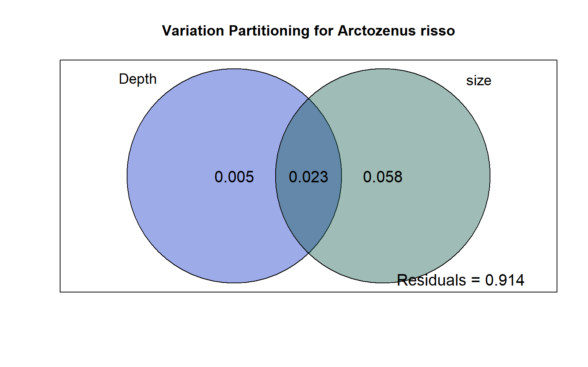
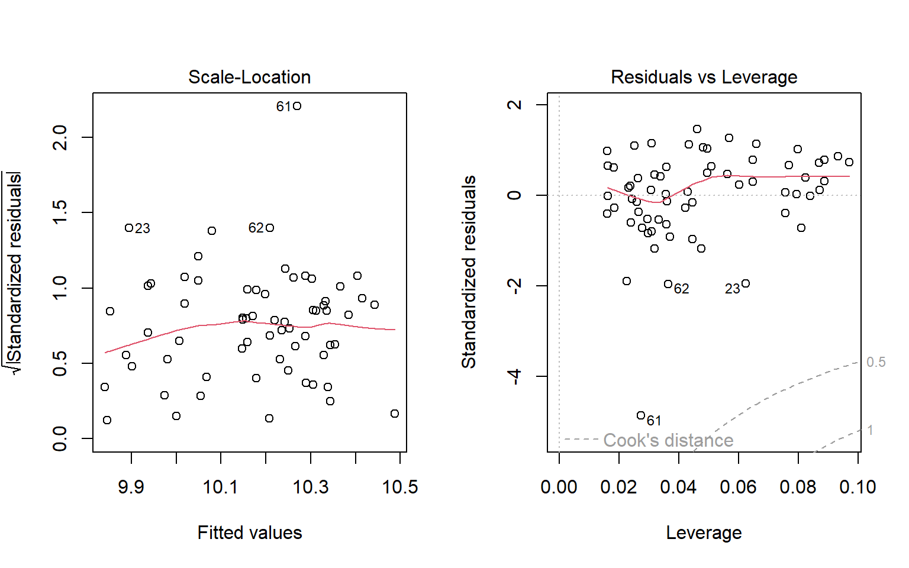

# Data load & preparation

::: {.cell}

```{.r .cell-code}
# Library ----
library(tidyr)
library(dplyr)
library(ggplot2)

# Isotopic data set ----
isotopic_dataset <-
  readxl::read_excel(here::here(
    "data",
    "C_N_isotopes_mesopelagic_2007-2021_BayofBiscay.xlsx"
  ),
  3) %>%
  # rename columns for simplicity
  rename(trawling_depth = `Trawling depth [m]`,
         size = `Standard length [cm] (individuals, mean)`,
         species = Taxa)%>%
  # create d15N column, when d15N untreated unaivailable we take d15N cyclohexane-delipidated
  mutate(d15N= coalesce(`δ15N (untreated)`,`δ15N (cyclohexane-delipidated)`))

# Trawling data set ----
trawling_dataset <-
  readxl::read_excel(here::here(
    "data",
    "Length_depth_distributions_mesopelagic_2011-2021_BayofBiscay.xlsx"
  ),
  3) %>%
  # rename columns for simplicity
  rename(trawling_depth = `Trawling depth [m]`,
         size = `Total length [cm]`,
         species = Species)%>%
  # add column with depth layer (cf Loutrage et al., 2023)
  mutate(
    depth_layer = case_when(
      between(trawling_depth, 0, 174) ~ "Epipelagic",
      between(trawling_depth, 175, 699) ~ "Upper mesopelagic",
      between(trawling_depth, 700, 999) ~ "Lower mesopelagic",
      between(trawling_depth, 1000, 2000) ~ "Bathypelagic")) %>%
  mutate(across(depth_layer, factor, levels = c("Epipelagic", "Upper mesopelagic", "Lower mesopelagic", "Bathypelagic")))
```
:::


# 1. Relationships between size and depth

## Community level
- Bigger fish at depth? 

::: {.cell}

```{.r .cell-code}
# median size in each depth layer
median_size_data <- trawling_dataset %>%
  group_by(depth_layer) %>%
  summarise(median_size = median(size)) %>%
  mutate(across(depth_layer, factor, levels = c("Epipelagic", "Upper mesopelagic", "Lower mesopelagic", "Bathypelagic")))

# plot
ggplot(trawling_dataset, aes(x = size)) +
  geom_density(
    alpha = 0.5,
    linewidth = 0.6,
    bw = 0.2,
    aes(col = depth_layer, fill = depth_layer)) +
  scale_fill_manual(values = c("#93C3FF", "#6799D3", "#3A72A8", "#002A58")) +
  scale_color_manual(values = c("#93C3FF", "#6799D3", "#3A72A8", "#002A58")) +
  facet_wrap( ~ depth_layer, ncol = 1, scales = "free_y") +
  theme_minimal() +
  scale_x_continuous(trans = 'log2') +
  theme(
    strip.text.x = element_text(size = 9, face = "bold"),
    strip.text.y = element_text(size = 9),
    axis.title = element_text(size = 9),
    axis.text =  element_text(size = 9, color = "grey50"),
    panel.background = element_rect(color = "white"),
    plot.background = element_rect(color = "white"),
    legend.title = element_text(size = 9),
    legend.text = element_text(size = 9)) +
  guides(fill = "none", col = "none") +
  xlab("Log2 total length (cm)") +
  geom_vline(
    data = median_size_data,
    aes(xintercept = median_size, color = depth_layer),
    linewidth = 0.6,
    linetype = "dashed")
```

::: {.cell-output-display}
{width=672}
:::

```{.r .cell-code}
# store the plot in the "figures" file in high resolution
#ggsave("density_plot_community.png", path = "figures", dpi = 700, height = 6, width = 6)
```
:::


### Linear relationship

::: {.cell}

```{.r .cell-code}
lr_size_depth_community <- trawling_dataset %>%
  do(broom::tidy(lm(size ~ trawling_depth, .))) %>%
  mutate(across(where(is.numeric), round, 2))

htmltools::tagList(DT::datatable(lr_size_depth_community))
```

::: {.cell-output-display}

```{=html}
<div class="datatables html-widget html-fill-item-overflow-hidden html-fill-item" id="htmlwidget-74340cb532e4b9a0f14a" style="width:100%;height:auto;"></div>
<script type="application/json" data-for="htmlwidget-74340cb532e4b9a0f14a">{"x":{"filter":"none","vertical":false,"data":[["1","2"],["(Intercept)","trawling_depth"],[8.91,0],[0.4,0],[22.4,7.34],[0,0]],"container":"<table class=\"display\">\n  <thead>\n    <tr>\n      <th> <\/th>\n      <th>term<\/th>\n      <th>estimate<\/th>\n      <th>std.error<\/th>\n      <th>statistic<\/th>\n      <th>p.value<\/th>\n    <\/tr>\n  <\/thead>\n<\/table>","options":{"columnDefs":[{"className":"dt-right","targets":[2,3,4,5]},{"orderable":false,"targets":0}],"order":[],"autoWidth":false,"orderClasses":false}},"evals":[],"jsHooks":[]}</script>
```

:::
:::


## Species level
### Linear relationships

::: {.cell}

```{.r .cell-code}
lr_size_depth_sp <- trawling_dataset %>%
  group_by(species) %>%
  do(broom::tidy(lm(size ~ trawling_depth, .))) %>%
  mutate(across(where(is.numeric), round, 2))

htmltools::tagList(DT::datatable(lr_size_depth_sp))
```

::: {.cell-output-display}

```{=html}
<div class="datatables html-widget html-fill-item-overflow-hidden html-fill-item" id="htmlwidget-97dac11721cb5868e1b6" style="width:100%;height:auto;"></div>
<script type="application/json" data-for="htmlwidget-97dac11721cb5868e1b6">{"x":{"filter":"none","vertical":false,"data":[["1","2","3","4","5","6","7","8","9","10","11","12","13","14","15","16","17","18","19","20","21","22","23","24"],["Aphanopus carbo","Aphanopus carbo","Arctozenus risso","Arctozenus risso","Argyropelecus olfersii","Argyropelecus olfersii","Lampanyctus crocodilus","Lampanyctus crocodilus","Lampanyctus macdonaldi","Lampanyctus macdonaldi","Melanostigma atlanticum","Melanostigma atlanticum","Myctophum punctatum","Myctophum punctatum","Notoscopelus kroyeri","Notoscopelus kroyeri","Searsia koefoedi","Searsia koefoedi","Serrivomer beanii","Serrivomer beanii","Stomias boa","Stomias boa","Xenodermichthys copei","Xenodermichthys copei"],["(Intercept)","trawling_depth","(Intercept)","trawling_depth","(Intercept)","trawling_depth","(Intercept)","trawling_depth","(Intercept)","trawling_depth","(Intercept)","trawling_depth","(Intercept)","trawling_depth","(Intercept)","trawling_depth","(Intercept)","trawling_depth","(Intercept)","trawling_depth","(Intercept)","trawling_depth","(Intercept)","trawling_depth"],[75.64,0.01,17.54,-0,6.7,0,9.6,0,14.12,0,3.55,0,7.06,-0,7.52,-0,12.22,0,53.92,0,25.09,0,9.09,0],[8.32,0.01,0.5,0,0.29,0,0.19,0,0.5600000000000001,0,0.87,0,0.14,0,0.2,0,1.25,0,3.52,0,1.99,0,0.32,0],[9.09,1.53,34.75,-1.21,22.99,0.38,50.14,7.92,25.12,0.52,4.09,5.21,50.63,-2.06,38.29,-0.11,9.800000000000001,0.17,15.33,0.17,12.58,0.08,28.86,3.36],[0,0.14,0,0.23,0,0.71,0,0,0,0.61,0,0,0,0.04,0,0.91,0,0.86,0,0.87,0,0.9399999999999999,0,0]],"container":"<table class=\"display\">\n  <thead>\n    <tr>\n      <th> <\/th>\n      <th>species<\/th>\n      <th>term<\/th>\n      <th>estimate<\/th>\n      <th>std.error<\/th>\n      <th>statistic<\/th>\n      <th>p.value<\/th>\n    <\/tr>\n  <\/thead>\n<\/table>","options":{"columnDefs":[{"className":"dt-right","targets":[3,4,5,6]},{"orderable":false,"targets":0}],"order":[],"autoWidth":false,"orderClasses":false}},"evals":[],"jsHooks":[]}</script>
```

:::
:::


### Density plot for significant relationships at the species level

::: {.cell}

```{.r .cell-code}
# selection of species with a significant size-depth relationship (from linear relationships)
trawling_dataset_significant <- filter(trawling_dataset,
                                    species %in% c("Lampanyctus crocodilus","Melanostigma atlanticum",
                                                   "Xenodermichthys copei","Myctophum punctatum"))

trawling_dataset_significant$species <- factor(trawling_dataset_significant$species,
                                    levels = c("Lampanyctus crocodilus",
                                             "Melanostigma atlanticum",
                                             "Xenodermichthys copei",
                                             "Myctophum punctatum"))

# Median depth
median_size_species <- trawling_dataset_significant %>%
  group_by(species, depth_layer) %>%
  summarise(median_size_sp = median(size))

# plot
ggplot(trawling_dataset_significant, aes(x=size)) +
  geom_density(alpha=0.3, linewidth=0.5, adjust= 2, aes(fill= depth_layer, col= depth_layer))+
  scale_fill_manual(values = c("#93C3FF", "#6799D3","#3A72A8", "#002A58"))+
  scale_color_manual(values = c("#93C3FF", "#6799D3","#3A72A8", "#002A58"))+
  facet_grid(depth_layer~species, scale="free")+
  theme_minimal()+
  theme(strip.text.x = element_text(size=12,face="italic"),
        strip.text.y = element_text(size=11),
        axis.title = element_text(size=13),
        axis.text =  element_text(size=10, color= "grey50"),
        panel.background=element_rect(color="white"),
        plot.background = element_rect(color = "white"),
        legend.title = element_text(size=10),
        legend.text = element_text(size=10))+
  guides(fill="none",col="none")+
  xlab("Total length (cm)")+
  geom_vline(data =median_size_species, aes(xintercept = median_size_sp, color=depth_layer),
             linewidth=0.6, linetype="dashed")
```

::: {.cell-output-display}
{width=1248}
:::

```{.r .cell-code}
# store the plot in the "figures" file in high resolution
#ggsave("density_plot_species.png", path = "figures", dpi = 700, height = 7, width = 9)
```
:::


# 2. $\delta$<sup>15</sup>N-size relationships
## At community level

::: {.cell}

```{.r .cell-code}
# Load isotope data
#isotope_data <- utils::read.csv(here::here("data", "ontogeny_isotopy_data.csv"), sep = ";", header = T, dec = ",")

# plot
ggplot(isotopic_dataset , aes(x=size, y=d15N))+
  geom_point (alpha=0.4, size=1) + 
  geom_smooth(method=lm, se=T, alpha=0.2, col= alpha("darkblue",0.7)) + 
  ggpmisc::stat_poly_eq(formula = y ~ x, 
                        aes(label = paste(..eq.label.., ..rr.label.., ..p.value.label.. 
                                          , ..n.label..,sep = "*`,`~")),
                        parse = TRUE,
                        size=4,
                        label.x.npc = "right",
                        label.y.npc = "bottom",
                        vstep = -0.0005)+ 
  scale_x_continuous(trans = 'log2') +
  xlab(bquote(Log[2]~"standard length (cm)"))+
  ylab(expression({delta}^15*N~'\u2030'))+
  ylim(c(7, 14))+
  guides(fill="none")+
  theme_minimal()+
  theme(strip.text.x = element_text(size=12,face="italic"),
        axis.title = element_text(size=12),
        axis.text =  element_text(size=12),
        plot.background = element_rect(colour = "white"))
```

::: {.cell-output-display}
{width=672}
:::

```{.r .cell-code}
# store the plot in the "figures" file in high resolution 
#ggsave("d15n_size_community.png", path = "figures", dpi = 700)
```
:::


## At species level
### Data summary

::: {.cell}

```{.r .cell-code}
data_sum <- isotopic_dataset %>%
  group_by(species) %>%
  summarise(
    range_size = max(size) - min(size),
    min_size = min(size),
    max_size = max(size),
    mean_size = mean(size),
    mean_d15n = mean(d15N),
    range_depth = max(trawling_depth) - min(trawling_depth)) %>%
  mutate(across(where(is.numeric), round, 2))

htmltools::tagList(DT::datatable(data_sum))
```

::: {.cell-output-display}

```{=html}
<div class="datatables html-widget html-fill-item-overflow-hidden html-fill-item" id="htmlwidget-30e545878135459ed06c" style="width:100%;height:auto;"></div>
<script type="application/json" data-for="htmlwidget-30e545878135459ed06c">{"x":{"filter":"none","vertical":false,"data":[["1","2","3","4","5","6","7","8","9","10","11","12"],["Aphanopus carbo","Arctozenus risso","Argyropelecus olfersii","Lampanyctus crocodilus","Lampanyctus macdonaldi","Melanostigma atlanticum","Myctophum punctatum","Notoscopelus kroyeri","Searsia koefoedi","Serrivomer beanii","Stomias boa","Xenodermichthys copei"],[37,9.5,6.7,8.300000000000001,3.3,4,4,8.1,6,45,21.8,13.9],[59,11,3.3,6.5,11.5,7,5,3.6,8.5,26.7,11.8,5.6],[96,20.5,10,14.8,14.8,11,9,11.7,14.5,71.7,33.6,19.5],[77.33,16.48,6.3,10.95,13.13,9.65,6.73,7.86,11.69,55.36,23.8,11.78],[12.36,10.53,10.18,10.46,11.54,11.21,9.99,11.18,11.8,9.49,11.61,9.83],[30,409,963,1229,666,278,1309,755,247,618,100,963]],"container":"<table class=\"display\">\n  <thead>\n    <tr>\n      <th> <\/th>\n      <th>species<\/th>\n      <th>range_size<\/th>\n      <th>min_size<\/th>\n      <th>max_size<\/th>\n      <th>mean_size<\/th>\n      <th>mean_d15n<\/th>\n      <th>range_depth<\/th>\n    <\/tr>\n  <\/thead>\n<\/table>","options":{"columnDefs":[{"className":"dt-right","targets":[2,3,4,5,6,7]},{"orderable":false,"targets":0}],"order":[],"autoWidth":false,"orderClasses":false}},"evals":[],"jsHooks":[]}</script>
```

:::
:::


### Linear relationships 

-  __A__: significant relationships 
-  __B__: non-significant relationships 
-  __Coefficient of variation__: The dispersion of the $\delta$<sup>15</sup>N values is not the same between the species having shown non-significant $\delta$<sup>15</sup>N-size relationships: *X. copei* presents a strong dispersion of its values (CV = 6.57) contrary to the values of *N. kroyeri* which remain relatively stable with the size of its individuals (CV = 2.15)
-   Do these differences translate into differences in their feeding strategies?

::: {.cell}

```{.r .cell-code}
# Selection of species presenting significant d15N-size relationship
ontogeny_significant <- filter(
  isotopic_dataset,
  species %in% c(
    "Lampanyctus crocodilus",
    "Aphanopus carbo",
    "Melanostigma atlanticum",
    "Serrivomer beanii",
    "Stomias boa",
    "Myctophum punctatum",
    "Arctozenus risso"
  )
)
# Order species
ontogeny_significant$species <- factor(
  ontogeny_significant$species,
  levels = c(
    "Myctophum punctatum",
    "Melanostigma atlanticum",
    "Lampanyctus crocodilus",
    "Stomias boa",
    "Serrivomer beanii",
    "Aphanopus carbo",
    "Arctozenus risso"
  )
)

# plot of significant relationships
plot_significant <- ggplot(ontogeny_significant, aes(x=size, y=d15N))+
  geom_point (alpha=0.4, col="black") + 
  geom_smooth(method=lm, se=T, alpha=0.2, col= alpha("darkblue",0.7)) +
  facet_wrap(~species, scale="free_x", ncol=3)+ 
  ggpmisc::stat_poly_eq(formula = y ~ x, 
                        aes(label = paste(..eq.label.., ..rr.label.., ..p.value.label.. 
                                          , ..n.label..,sep = "*`,`~")),
                        parse = TRUE,
                        size=3.38,
                        label.x.npc = "right",
                        label.y.npc = "bottom",
                        vstep = -0.0005)+ 
  xlab("")+
  ylab(expression({delta}^15*N~'\u2030'))+
  ylim(c(7,13))+
  guides(color="none", fill="none")+
  theme_minimal()+
  theme(strip.text.x = element_text(size=15,face="italic"),
        plot.background = element_rect(colour = "white"),
        axis.title = element_text(size=14),
        axis.text =  element_text(size=13))

# Selection of species presenting non-significant d15N-size relationship
ontogeny_non_significant <- filter(isotopic_dataset,
                                   species %in% c("Argyropelecus olfersii", "Lampanyctus macdonaldi",
                                                  "Searsia koefoedi", "Notoscopelus kroyeri",
                                                  "Xenodermichthys copei"))

#order species 
ontogeny_non_significant$species <- factor(ontogeny_non_significant$species,
                                           levels = c("Xenodermichthys copei",
                                                      "Searsia koefoedi",
                                                      "Argyropelecus olfersii",
                                                      "Lampanyctus macdonaldi",
                                                      "Notoscopelus kroyeri"))

# function to calculate coefficient of variation 
cv <- function(x) {
  (sd(x) / mean(x)) * 100
}
coeff_var <- aggregate(d15N ~ species,
                       data = ontogeny_non_significant,
                       FUN = cv)
coeff_var$d15N <- round(coeff_var$d15N, digits = 2)


# plot of non-significant relationships
plot_non_significant <- ggplot(ontogeny_non_significant, aes(x=size, y=d15N))+
  geom_point (alpha=0.4, col="black") + 
  facet_wrap(~species, scale="free_x", ncol=3, nrow = 3)+ 
  ggpmisc::stat_poly_eq(formula = y ~ x, 
                        aes(label = paste( ..n.label..,sep = "*`,`~")),
                        parse = TRUE,
                        size=4,
                        label.x.npc = "right",
                        label.y.npc = "bottom",
                        vstep = -0.0005)+ 
  xlab("Standard Length (cm)")+
  ylab(expression({delta}^15*N~'\u2030'))+
  ylim(c(7, 14))+
  guides(color="none", fill="none")+
  theme_minimal()+
  theme(strip.text.x = element_text(size=15,face="italic"),
        axis.title = element_text(size=14),
        plot.background = element_rect(colour = "white"),
        axis.text =  element_text(size=13))+
  geom_text(coeff_var, mapping = aes(x = -Inf, y = -Inf, label = paste("CV = ", d15N, sep = "")),
            hjust = -0.2, vjust = -0.8, size = 4)

# Combine the two plot 
ggpubr::ggarrange(
  plot_significant,
  plot_non_significant,
  ncol = 1,
  labels = c("A", "B"),
  heights = c(2, 1.25)
)
```

::: {.cell-output-display}
{width=960}
:::

```{.r .cell-code}
# store the plot in the "figures" file in high resolution 
#ggsave("d15n_size_sp.png", path = "figures", dpi = 700, height = 13, width = 10)
```
:::


# 3. Variation partitionning

-   At the species level, is it the sampling depth or the size of the individuals that most influences the values in $\delta$<sup>15</sup>N?
-  To test the significance of the influence of each variable (depth and size) on $\delta$<sup>15</sup>N values an ANOVA-type permutation test was performed for each model (anova.cca function)
-  Since the third fraction (depth and size) is not the result of an RDA, it cannot be tested for significance.


::: {.cell}

```{.r .cell-code}
# S. boa and A. carbo not considered in this analysis due to small depth range sampled
varpart_data <- isotopic_dataset %>%
  filter(!species %in% c("Stomias boa", "Aphanopus carbo")) %>%
  arrange(species)

# List of species names
species_list <- unique(varpart_data$species)

# Initialize an empty list to store the results
result_list <- list()

# Initialize an empty data frame to store indfract values (variance of d15N values explained by depth and size)
indfract_df <-
  data.frame(species = character(0),
             indfract = numeric(0),
             variable = character(0))

# Loop through each species
for (species_name in species_list) {
  # Filter the data for the current species
  species_data <- varpart_data %>%
    filter(species == species_name)
  
  # Perform variation partitioning analysis
  species_part <- vegan::varpart(species_data$d15N,
                                 ~ trawling_depth, ~ size, data = species_data)
  
  # Create the specified plot for the current species
  plot <- plot(
    species_part,
    Xnames = c("Depth", "size"),
    # name the partitions
    bg = c("#072AC8", "#0B5345"),
    alpha = 100,
    # colour the circles
    digits = 2,
    # only show 2 digits
    cex = 1.4
  )
  
  # Add a title to the plot
  title(main = paste("Variation Partitioning for", species_name))
  
  # Perform the significance testing
  rda1 <- vegan::rda(species_data$d15N,
                     species_data$trawling_depth,
                     species_data$size)
  rda2 <- vegan::rda(species_data$d15N,
                     species_data$size,
                     species_data$trawling_depth)
  anova1 <- vegan::anova.cca(rda1)
  anova2 <- vegan::anova.cca(rda2)
  
  # Store the results, the plot, and the significance testing in the list
  result_list[[species_name]] <-
    list(
      varpart_results = species_part,
      varpart_plot = plot,
      anova_depth_size = anova1,
      anova_size_depth = anova2
    )
  
  # Extract and store the indfract value (variance explained by each variable) in the data frame
  indfract_value <- species_part$part$indfract$Adj.R.squared
  indfract_df <-
    rbind(
      indfract_df,
      data.frame(
        species = species_name,
        indfract = indfract_value,
        variable = c("Depth only", "Size only", "Depth and size", "Residuals")
      )
    )
  
  # Print the plot
  print(plot)
  
  # Print the significance testing results
  cat("ANOVA (Depth-Size):\n")
  print(broom::tidy(anova1))
  
  cat("ANOVA (Size-Depth):\n")
  print(broom::tidy(anova2))
  
  cat("\n")
}
```

::: {.cell-output-display}
{width=672}
:::

::: {.cell-output .cell-output-stdout}
```
NULL
ANOVA (Depth-Size):
# A tibble: 2 × 5
  term        df Variance statistic p.value
  <chr>    <dbl>    <dbl>     <dbl>   <dbl>
1 Model        1  0.00218      1.43   0.239
2 Residual    75  0.114       NA     NA    
ANOVA (Size-Depth):
# A tibble: 2 × 5
  term        df Variance statistic p.value
  <chr>    <dbl>    <dbl>     <dbl>   <dbl>
1 Model        1  0.00878      5.78   0.024
2 Residual    75  0.114       NA     NA    
```
:::

::: {.cell-output-display}
{width=672}
:::

::: {.cell-output .cell-output-stdout}
```
NULL
ANOVA (Depth-Size):
# A tibble: 2 × 5
  term        df Variance statistic p.value
  <chr>    <dbl>    <dbl>     <dbl>   <dbl>
1 Model        1   0.0152      4.92   0.033
2 Residual    61   0.189      NA     NA    
ANOVA (Size-Depth):
# A tibble: 2 × 5
  term        df Variance statistic p.value
  <chr>    <dbl>    <dbl>     <dbl>   <dbl>
1 Model        1   0.0103      3.34   0.063
2 Residual    61   0.189      NA     NA    
```
:::

::: {.cell-output-display}
{width=672}
:::

::: {.cell-output .cell-output-stdout}
```
NULL
ANOVA (Depth-Size):
# A tibble: 2 × 5
  term        df Variance statistic p.value
  <chr>    <dbl>    <dbl>     <dbl>   <dbl>
1 Model        1 0.000170    0.0807   0.767
2 Residual   139 0.292      NA       NA    
ANOVA (Size-Depth):
# A tibble: 2 × 5
  term        df Variance statistic p.value
  <chr>    <dbl>    <dbl>     <dbl>   <dbl>
1 Model        1    0.115      54.5   0.001
2 Residual   139    0.292      NA    NA    
```
:::

::: {.cell-output-display}
{width=672}
:::

::: {.cell-output .cell-output-stdout}
```
NULL
ANOVA (Depth-Size):
# A tibble: 2 × 5
  term        df Variance statistic p.value
  <chr>    <dbl>    <dbl>     <dbl>   <dbl>
1 Model        1  0.00254     0.578   0.478
2 Residual    20  0.0879     NA      NA    
ANOVA (Size-Depth):
# A tibble: 2 × 5
  term        df Variance statistic p.value
  <chr>    <dbl>    <dbl>     <dbl>   <dbl>
1 Model        1  0.00572      1.30    0.29
2 Residual    20  0.0879      NA      NA   
```
:::

::: {.cell-output-display}
{width=672}
:::

::: {.cell-output .cell-output-stdout}
```
NULL
ANOVA (Depth-Size):
# A tibble: 2 × 5
  term        df    Variance  statistic p.value
  <chr>    <dbl>       <dbl>      <dbl>   <dbl>
1 Model        1 0.000000616  0.0000724   0.994
2 Residual    23 0.196       NA          NA    
ANOVA (Size-Depth):
# A tibble: 2 × 5
  term        df Variance statistic p.value
  <chr>    <dbl>    <dbl>     <dbl>   <dbl>
1 Model        1   0.0324      3.81   0.075
2 Residual    23   0.196      NA     NA    
```
:::

::: {.cell-output-display}
{width=672}
:::

::: {.cell-output .cell-output-stdout}
```
NULL
ANOVA (Depth-Size):
# A tibble: 2 × 5
  term        df Variance statistic p.value
  <chr>    <dbl>    <dbl>     <dbl>   <dbl>
1 Model        1  0.00449      1.75    0.19
2 Residual    77  0.198       NA      NA   
ANOVA (Size-Depth):
# A tibble: 2 × 5
  term        df Variance statistic p.value
  <chr>    <dbl>    <dbl>     <dbl>   <dbl>
1 Model        1   0.0673      26.2   0.001
2 Residual    77   0.198       NA    NA    
```
:::

::: {.cell-output-display}
{width=672}
:::

::: {.cell-output .cell-output-stdout}
```
NULL
ANOVA (Depth-Size):
# A tibble: 2 × 5
  term        df Variance statistic p.value
  <chr>    <dbl>    <dbl>     <dbl>   <dbl>
1 Model        1 0.000379     0.480   0.477
2 Residual    72 0.0568      NA      NA    
ANOVA (Size-Depth):
# A tibble: 2 × 5
  term        df Variance statistic p.value
  <chr>    <dbl>    <dbl>     <dbl>   <dbl>
1 Model        1 0.000252     0.320   0.589
2 Residual    72 0.0568      NA      NA    
```
:::

::: {.cell-output-display}
{width=672}
:::

::: {.cell-output .cell-output-stdout}
```
NULL
ANOVA (Depth-Size):
# A tibble: 2 × 5
  term        df Variance statistic p.value
  <chr>    <dbl>    <dbl>     <dbl>   <dbl>
1 Model        1  0.00619     0.350   0.598
2 Residual    17  0.300      NA      NA    
ANOVA (Size-Depth):
# A tibble: 2 × 5
  term        df Variance statistic p.value
  <chr>    <dbl>    <dbl>     <dbl>   <dbl>
1 Model        1   0.0155     0.880   0.368
2 Residual    17   0.300     NA      NA    
```
:::

::: {.cell-output-display}
{width=672}
:::

::: {.cell-output .cell-output-stdout}
```
NULL
ANOVA (Depth-Size):
# A tibble: 2 × 5
  term        df Variance statistic p.value
  <chr>    <dbl>    <dbl>     <dbl>   <dbl>
1 Model        1  0.00349     0.409   0.523
2 Residual    28  0.239      NA      NA    
ANOVA (Size-Depth):
# A tibble: 2 × 5
  term        df Variance statistic p.value
  <chr>    <dbl>    <dbl>     <dbl>   <dbl>
1 Model        1   0.0450      5.28   0.019
2 Residual    28   0.239      NA     NA    
```
:::

::: {.cell-output-display}
{width=672}
:::

::: {.cell-output .cell-output-stdout}
```
NULL
ANOVA (Depth-Size):
# A tibble: 2 × 5
  term        df Variance statistic p.value
  <chr>    <dbl>    <dbl>     <dbl>   <dbl>
1 Model        1   0.0263      7.48   0.008
2 Residual   111   0.391      NA     NA    
ANOVA (Size-Depth):
# A tibble: 2 × 5
  term        df Variance statistic p.value
  <chr>    <dbl>    <dbl>     <dbl>   <dbl>
1 Model        1 0.000203    0.0576   0.795
2 Residual   111 0.391      NA       NA    
```
:::
:::


## Variance partitionning summary 
- compile information on a single plot for all species 

::: {.cell}

```{.r .cell-code}
#order according to the variance explained by each species 
indfract_df$species <- factor(
  indfract_df$species,
  levels = c(
    "Notoscopelus kroyeri",
    "Searsia koefoedi",
    "Lampanyctus macdonaldi",
    "Xenodermichthys copei",
    "Arctozenus risso",
    "Argyropelecus olfersii",
    "Serrivomer beanii",
    "Melanostigma atlanticum",
    "Myctophum punctatum",
    "Lampanyctus crocodilus"
  )
)

# Percentage of variance for each variable + residuals
var_freq <- indfract_df %>%
  group_by(species) %>%
  mutate(freq = ((indfract * 100) / sum(indfract)))

# Order variable
var_freq$variable <- factor(var_freq$variable,
                            levels = c("Residuals", "Depth only", "Depth and size", "Size only"))


# plot
ggplot(var_freq , aes(fill=variable, y=freq, x=species)) + 
  geom_bar(position="stack", stat="identity", alpha=0.6, linewidth=0.5)+
  scale_fill_manual(values = c("#33505C","#861D31","#D8973C"))+
  theme_light()+
  coord_flip()+
  ylim(c(0,40))+
  ylab("Percentage variance (%)")+
  xlab("")+
  theme(axis.text.y = element_text(face ="italic", size=11),
        axis.title = element_text(size=11),
        legend.text = element_text(size=11),
        legend.title = element_text(size=11),
        axis.text.x = element_text(size=11))+
  guides(fill=guide_legend(title="Explanatory variables"),
         color="none")
```

::: {.cell-output-display}
{width=864}
:::

```{.r .cell-code}
# store the plot in the "figures" file in high resolution 
#ggsave("d15n_variability.png", path = "figures", dpi = 700, width = 8, height = 5)
```
:::


# 4. Appendices
## Test of temporal variability on $\delta$<sup>15</sup>N values

::: {.cell}

```{.r .cell-code}
# color for each sampling Years
col_Years <- c("#FFC75F", "#F3C5FF", "#845EC2", "#C34A36", "#3596B5", "grey")

# Years in discrete variable
isotopic_dataset$Years <- as.character(isotopic_dataset$Years)

# plot
ggplot(isotopic_dataset , aes(x=size, y=d15N))+
  geom_point (alpha=0.9, aes(col=Years), size=1.5) + 
  scale_color_manual(values = col_Years)+
  facet_wrap(~species, scale="free_x", ncol=3)+ 
  xlab("Standard Length (cm)")+
  ylab(expression({delta}^15*N~'\u2030'))+
  theme_light()+
  labs(col= "Sampling Years")+
  theme(strip.text.x = element_text(size=13,face="italic"),
        axis.title = element_text(size=12),
        axis.text =  element_text(size=12),
        legend.title = element_text(size=12),
        legend.text = element_text(size=12),
        panel.background = element_rect(fill = "white",colour = "white"),
        plot.background = element_rect(fill = "white",colour = "white"))
```

::: {.cell-output-display}
{width=1440}
:::

```{.r .cell-code}
#store the plot in the "figures" file in high resolution 
ggsave("Appendix_1.tiff", path = "figures", dpi = 600, height = 7, width = 9)
```
:::


## Representativeness of sample sizes between the two data sets 
- In order to compare the sizes of the species in the two data sets, a conversion from standard size to total size was carried out using conversion equations estimated in the laboratory by Tiphaine Chouvelon. 

::: {.cell}

```{.r .cell-code}
# conversion standard length in total length for the isotope dataset (equations by Tiphaine Chouvelon)
isotopic_dataset_TL <- isotopic_dataset %>%
  mutate(
    total_length = case_when(
      species == "Aphanopus carbo" & size < 85 ~ size + 3,
      species == "Aphanopus carbo" & size > 85 ~ size + 5,
      species == "Arctozenus risso" ~ size + 1,
      species == "Argyropelecus olfersii" ~ (size + 0.7913) / 0.9039,
      species == "Lampanyctus crocodilus" ~ (size + 0.4754) / 0.8284,
      species == "Lampanyctus macdonaldi" ~ (size + 0.4754) / 0.8284,
      species == "Melanostigma atlanticum" ~ size,
      species == "Myctophum punctatum" ~ (size - 1.0381) / 0.7373,
      species == "Notoscopelus kroyeri" ~ (size + 0.2406) / 0.8903,
      species == "Searsia koefoedi" ~ (size - 0.7343) / 0.8593,
      species == "Serrivomer beanii" ~ (size + 0.6654) / 1.0053,
      species == "Stomias boa" ~ (size + 0.2633) / 0.9679,
      species == "Xenodermichthys copei" ~ (size + 0.0631) / 0.9266)) %>%
  select(species, total_length) %>%
  mutate(data_set = "isotopic dataset") %>%
  rename("size" = "total_length")

# formatting the trawling data set
trawling_dataset_comparaison <- trawling_dataset %>%
  select(species, size) %>%
  mutate(data_set = "trawling dataset")

# merge the two data frame
size_comparaison <-
  rbind(trawling_dataset_comparaison, isotopic_dataset_TL)

# plot
ggplot(size_comparaison, aes(x=size)) +
  geom_density(alpha=0.3, linewidth=0.7, aes(col=data_set, fill= data_set))+
  scale_color_manual(values = c("#3596B5", "#B0A8B9"), labels = c("Isotopic dataset", "Trawling dataset"))+
  scale_fill_manual(values = c("#3596B5", "#B0A8B9"), labels = c("Isotopic dataset", "Trawling dataset"))+
  facet_wrap(~species, scale="free", ncol=3)+
  theme_minimal()+
  theme(strip.text.x = element_text(size=11,face="italic"),
        axis.title = element_text(size=13),
        axis.text =  element_text(size=13),
        legend.title = element_text(size=13),
        legend.text = element_text(size=13),
        panel.background = element_rect(fill = "white",colour = "white"),
        plot.background = element_rect(fill = "white",colour = "white"))+
  xlab("Standard length (cm)")+
  guides(fill=guide_legend(title="Dataset"), col=guide_legend(title="Dataset"))
```

::: {.cell-output-display}
{width=1440}
:::

```{.r .cell-code}
# store the plot in the "figures" file in high resolution 
ggsave("Appendix_2.tiff", path = "figures", dpi = 600, width = 9, height = 7)
```
:::


## Non-significant size-depth relationships at species level

::: {.cell}

```{.r .cell-code}
# Selection of non-significant size-depth relationships
trawling_dataset_ns <-
  filter(
    trawling_dataset,
    species %in% c(
      "Arctozenus risso",
      "Lampanyctus macdonaldi",
      "Notoscopelus kroyeri",
      "Searsia koefoedi",
      "Serrivomer beanii",
      "Argyropelecus olfersii",
      "Stomias boa boa",
      "Aphanopus carbo"))

# order species
trawling_dataset_ns$species <- factor(
  trawling_dataset_ns$species,
  levels = c(
    "Notoscopelus kroyeri",
    "Serrivomer beanii",
    "Stomias boa boa",
    "Argyropelecus olfersii",
    "Arctozenus risso",
    "Searsia koefoedi",
    "Aphanopus carbo",
    "Lampanyctus macdonaldi"),
  labels = c(
    "N. kroyeri",
    "S. beanii",
    "S. boa",
    "A. olfersii",
    "A. risso",
    "S. koefoedi",
    "A. carbo",
    "L.macdonaldi"))

# Median depth
median_size_sp_ns <- trawling_dataset_ns %>%
  group_by(depth_layer, species) %>%
  summarise(median_size = median(size))

# plot
ggplot(trawling_dataset_ns, aes(x=size)) +
  geom_density(alpha=0.3, linewidth=0.8, adjust= 2, aes(fill= depth_layer, col= depth_layer))+
  scale_fill_manual(values = c("#93C3FF", "#6799D3","#3A72A8", "#002A58"))+
  scale_color_manual(values = c("#93C3FF", "#6799D3","#3A72A8", "#002A58"))+
  facet_grid(depth_layer~species, scale="free")+
  theme_minimal()+
  theme(strip.text.x = element_text(size=12, face="italic"),
        strip.text.y = element_text(size=12),
        axis.title = element_text(size=12),
        axis.text =  element_text(size=11, color= "grey50"),
        panel.background=element_rect(color="white"),
        plot.background = element_rect(fill = "white",colour = "white"),
        legend.title = element_text(size=12),
        legend.text = element_text(size=12))+
  guides(fill="none",col="none")+
  xlab("Total Length (cm)")+
  geom_vline(data =median_size_sp_ns, aes(xintercept = median_size, color=depth_layer),
             linewidth=0.6, linetype="dashed")
```

::: {.cell-output-display}
{width=1536}
:::

```{.r .cell-code}
# store the plot in the "figures" file in high resolution 
ggsave("Appendix_3.tiff", path = "figures", dpi = 600, width = 9, height = 7)
```
:::
