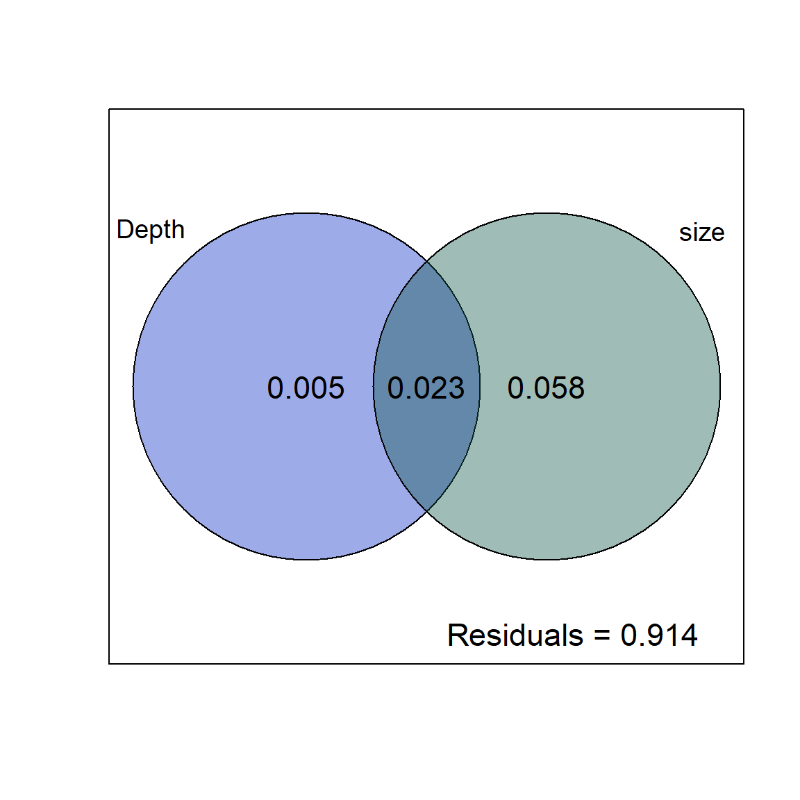
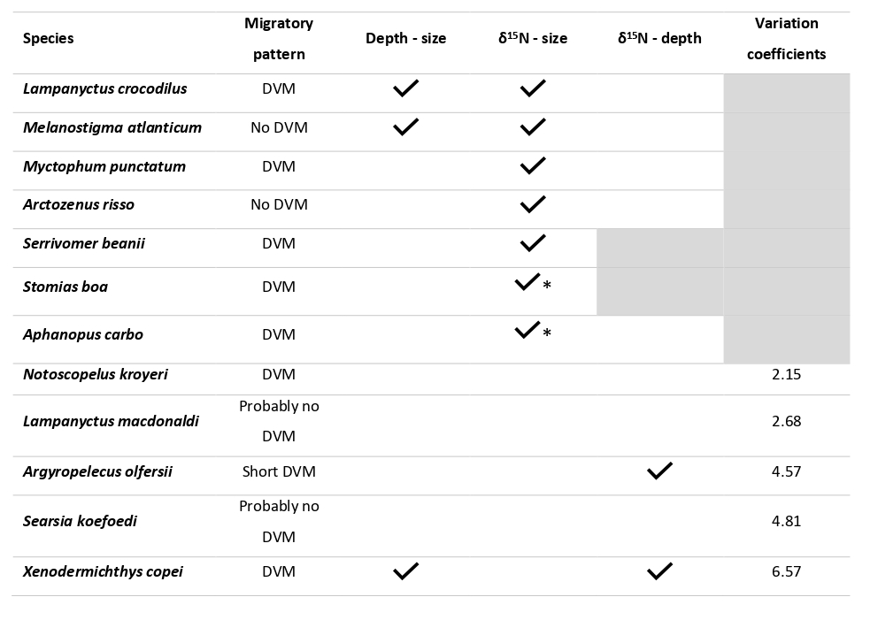

# 1. Size distribution as a function of depth

## Density plot by depth layer - community level

-   Bigger fish at depth ?


::: {.cell}
::: {.cell-output-display}
{width=672}
:::
:::

::: {.cell}
::: {.cell-output .cell-output-stdout}
```

	Kruskal-Wallis rank sum test

data:  size by depth_layer
Kruskal-Wallis chi-squared = 136.67, df = 3, p-value < 2.2e-16
```
:::

::: {.cell-output .cell-output-stdout}
```

	Pairwise comparisons using Wilcoxon rank sum test with continuity correction 

data:  large_dataset$size and large_dataset$depth_layer 

                  Epipelagic Upper mesopelagic Lower mesopelagic
Upper mesopelagic 1.9e-12    -                 -                
Lower mesopelagic 7.1e-13    < 2e-16           -                
Bathypelagic      1.1e-14    7.1e-13           0.36             

P value adjustment method: BH 
```
:::
:::


## Density plot by depth layer - species level


::: {.cell}
::: {.cell-output-display}
{width=1440}
:::
:::


### Wilcoxon test at species level:

***Lampanyctus crocodilus*** :


::: {.cell}
::: {.cell-output .cell-output-stdout}
```

	Kruskal-Wallis rank sum test

data:  size by depth_layer
Kruskal-Wallis chi-squared = 281.78, df = 2, p-value < 2.2e-16
```
:::

::: {.cell-output .cell-output-stdout}
```

	Pairwise comparisons using Wilcoxon rank sum test with continuity correction 

data:  Lamp_cro$size and Lamp_cro$depth_layer 

                  bathypelagic lower_mesopelagic
lower_mesopelagic 0.48         -                
upper_mesopelagic <2e-16       <2e-16           

P value adjustment method: BH 
```
:::
:::


***Melanostigma atlanticum***:


::: {.cell}
::: {.cell-output .cell-output-stdout}
```

	Kruskal-Wallis rank sum test

data:  size by depth_layer
Kruskal-Wallis chi-squared = 36.266, df = 2, p-value = 1.333e-08
```
:::

::: {.cell-output .cell-output-stdout}
```

	Pairwise comparisons using Wilcoxon rank sum test with continuity correction 

data:  mela_atl$size and mela_atl$depth_layer 

                  bathypelagic lower_mesopelagic
lower_mesopelagic 3e-08        -                
upper_mesopelagic 0.035        0.282            

P value adjustment method: BH 
```
:::
:::


***Xenodermichthys copei***:


::: {.cell}
::: {.cell-output .cell-output-stdout}
```

	Kruskal-Wallis rank sum test

data:  size by depth_layer
Kruskal-Wallis chi-squared = 9.3788, df = 2, p-value = 0.009192
```
:::

::: {.cell-output .cell-output-stdout}
```

	Pairwise comparisons using Wilcoxon rank sum test with continuity correction 

data:  xeno_cop$size and xeno_cop$depth_layer 

                  bathypelagic lower_mesopelagic
lower_mesopelagic 0.2584       -                
upper_mesopelagic 0.2584       0.0085           

P value adjustment method: BH 
```
:::
:::


***Myctophum punctatum***:


::: {.cell}
::: {.cell-output .cell-output-stdout}
```

	Kruskal-Wallis rank sum test

data:  size by depth_layer
Kruskal-Wallis chi-squared = 16.032, df = 3, p-value = 0.001117
```
:::

::: {.cell-output .cell-output-stdout}
```

	Pairwise comparisons using Wilcoxon rank sum test with continuity correction 

data:  mycto_punc$size and mycto_punc$depth_layer 

                  bathypelagic epipelagic lower_mesopelagic
epipelagic        0.5892       -          -                
lower_mesopelagic 0.4431       0.7591     -                
upper_mesopelagic 0.0038       0.0038     0.0017           

P value adjustment method: BH 
```
:::
:::


# 2. $\delta$<sup>15</sup>N-size relationships

-   Sampling of some individuals to obtain $\delta$<sup>15</sup>N values

## At community level

-   Can we observe an increase in $\delta$<sup>15</sup>N values (proxy of trophic level) with increasing size of individuals in the deep pelagic fish community of the Bay of Biscay?

-   X axis (size) in log<sub>2</sub>

-   Significant increase but very small slope


::: {.cell}
::: {.cell-output-display}
{width=672}
:::
:::


## At species level

-   $\delta$<sup>15</sup>N axis standardized


::: {.cell}
::: {.cell-output-display}
{width=960}
:::
:::


## Variation coefficients

-   The dispersion of the $\delta$<sup>15</sup>N values is not the same between the species having shown non-significant $\delta$<sup>15</sup>N-size relationships: *X. copei* presents a strong dispersion of its values (CV = 6.57) contrary to the values of *N. kroyeri* which remain relatively stable with the size of its individuals (CV = 2.15)

-   Do these differences translate into differences in their feeding strategies?


::: {.cell}

```{.r .cell-code}
cv <- function(x){
  (sd(x)/mean(x))*100
}

coeff_var <- aggregate(d15N_muscle_untreated ~ species, 
                       data = ontogeny_non_significant,
                       FUN = cv)
DT::datatable(coeff_var)
```

::: {.cell-output-display}

```{=html}
<div class="datatables html-widget html-fill-item-overflow-hidden html-fill-item" id="htmlwidget-155551b979009b352d4d" style="width:100%;height:auto;"></div>
<script type="application/json" data-for="htmlwidget-155551b979009b352d4d">{"x":{"filter":"none","vertical":false,"data":[["1","2","3","4","5"],["Xenodermichthys copei","Searsia koefoedi","Argyropelecus olfersii","Lampanyctus macdonaldi","Notoscopelus kroyeri"],[6.57390838338306,4.81349917264628,4.56980842451252,2.67789179492498,2.14882039847784]],"container":"<table class=\"display\">\n  <thead>\n    <tr>\n      <th> <\/th>\n      <th>species<\/th>\n      <th>d15N_muscle_untreated<\/th>\n    <\/tr>\n  <\/thead>\n<\/table>","options":{"columnDefs":[{"className":"dt-right","targets":2},{"orderable":false,"targets":0}],"order":[],"autoWidth":false,"orderClasses":false}},"evals":[],"jsHooks":[]}</script>
```

:::
:::


# 4. Variation partitionning

-   At the species level, is it the sampling depth or the size of the individuals that most influences the values in $\delta$<sup>15</sup>N?

## At community level


::: {.cell}
::: {.cell-output .cell-output-stdout}
```
No. of explanatory tables: 2 
Total variation (SS): 464.43 
            Variance: 0.68198 
No. of observations: 682 

Partition table:
                     Df R.squared Adj.R.squared Testable
[a+c] = X1            1   0.00908       0.00762     TRUE
[b+c] = X2            1   0.00388       0.00242     TRUE
[a+b+c] = X1+X2       2   0.01124       0.00833     TRUE
Individual fractions                                    
[a] = X1|X2           1                 0.00591     TRUE
[b] = X2|X1           1                 0.00070     TRUE
[c]                   0                 0.00171    FALSE
[d] = Residuals                         0.99167    FALSE
---
Use function 'rda' to test significance of fractions of interest
```
:::

::: {.cell-output-display}
{width=576}
:::

::: {.cell-output .cell-output-stdout}
```
Permutation test for rda under reduced model
Permutation: free
Number of permutations: 999

Model: rda(X = ontogeny_data$d15N_muscle_untreated, Y = ontogeny_data$trawling_depth, Z = ontogeny_data$size)
          Df Variance      F Pr(>F)  
Model      1  0.00502 5.0547  0.021 *
Residual 679  0.67432                
---
Signif. codes:  0 '***' 0.001 '**' 0.01 '*' 0.05 '.' 0.1 ' ' 1
```
:::
:::


### Significance testing

#### \[a\] Depth alone


::: {.cell}

:::


#### \[a\] size alone


::: {.cell}

:::


## *Lampanyctus crocodilus*


::: {.cell}
::: {.cell-output .cell-output-stdout}
```
No. of explanatory tables: 2 
Total variation (SS): 62.194 
            Variance: 0.44109 
No. of observations: 142 

Partition table:
                     Df R.squared Adj.R.squared Testable
[a+c] = X1            1   0.07704       0.07045     TRUE
[b+c] = X2            1   0.33675       0.33202     TRUE
[a+b+c] = X1+X2       2   0.33714       0.32760     TRUE
Individual fractions                                    
[a] = X1|X2           1                -0.00442     TRUE
[b] = X2|X1           1                 0.25715     TRUE
[c]                   0                 0.07487    FALSE
[d] = Residuals                         0.67240    FALSE
---
Use function 'rda' to test significance of fractions of interest
```
:::

::: {.cell-output-display}
{width=576}
:::
:::


### Significance testing

#### \[a\] Depth alone


::: {.cell}

:::


#### \[c\] Size alone


::: {.cell}

:::


## *Myctophum punctatum*


::: {.cell}
::: {.cell-output-display}
{width=576}
:::
:::

::: {.cell}

:::

::: {.cell}

:::


## *Melanostigma atlanticum*


::: {.cell}
::: {.cell-output-display}
{width=576}
:::
:::

::: {.cell}

:::

::: {.cell}

:::


## *Serrivomer beanii*


::: {.cell}
::: {.cell-output-display}
{width=576}
:::
:::

::: {.cell}

:::

::: {.cell}

:::


## *Argyropelecus olfersii*


::: {.cell}
::: {.cell-output-display}
{width=576}
:::
:::

::: {.cell}

:::

::: {.cell}

:::


## *Lampanyctus macdonaldi*


::: {.cell}
::: {.cell-output-display}
{width=576}
:::
:::

::: {.cell}

:::

::: {.cell}

:::


## *Searsia koefoedi*


::: {.cell}
::: {.cell-output-display}
{width=576}
:::
:::

::: {.cell}

:::

::: {.cell}

:::


## *Notoscopelus kroyeri*


::: {.cell}
::: {.cell-output-display}
{width=576}
:::
:::

::: {.cell}

:::

::: {.cell}

:::


## *Xenodermichthys copei*


::: {.cell}
::: {.cell-output-display}
{width=576}
:::
:::

::: {.cell}

:::

::: {.cell}

:::


## *Arctozenus risso*


::: {.cell}
::: {.cell-output-display}
{width=576}
:::
:::

::: {.cell}

:::

::: {.cell}

:::


## Variance partitionning summary


::: {.cell}
::: {.cell-output-display}
{width=1248}
:::
:::


# 5. Summary table

**Testing significance:**

-   $\delta$<sup>15</sup>N - Size & $\delta$<sup>15</sup>N - depth : use of the anova.cca() function to test the significance of each part separately (depth & size) on the variability of $\delta$<sup>15</sup>N values
-   Depth - size : test with linear model lm (size\~depth)
-   *Stomias boa* & *Aphanopus carbo* \* depth range too small (\< 100m) so no use of variance partition models on these species, but linear models $\delta$<sup>15</sup>N - size significant

{width="70%"}

# 6. Limits

## Test of temporal variability on $\delta$<sup>15</sup>N values

-   Difficult to test because it is necessary to eliminate the biases due to size and depth.

-   However, over 90% of the sampling has been completed between 2019 and 2021 (and almost 3/4 in 2021)

-   If major environmental changes had occurred that significantly altered the baseline over time, this would have been observed in all species in the same way, which does not appear to be the case here

-   Test with *Lampnyctus crocodilus*: In the bathypelagic layer and individuals between 10 and 12cm : non signifiant differences

-   we can see that the data from the different years merge, there does not seem to be a strong effect of the year of sampling on the $\delta$<sup>15</sup>N values

-   In supplementary material ?

-   

    -   only night sampling


::: {.cell}
::: {.cell-output-display}
{width=2400}
:::
:::


## Representativeness of the sampling of individuals for $\delta$<sup>15</sup>N values

-   In supplementary material ?
-   no sampling of small *M. atlanticum* and big *L. macdonaldi*
-   but overall good sampling coverage over the size ranges of the species


::: {.cell}
::: {.cell-output-display}
{width=1920}
:::
:::
