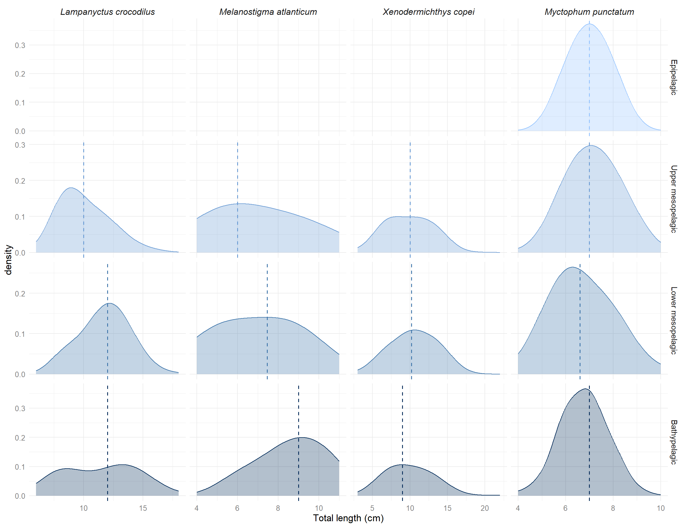
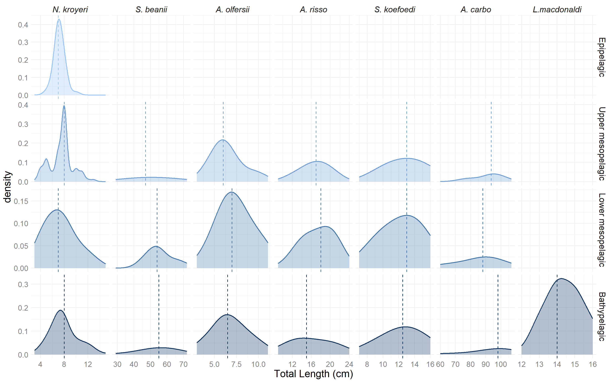

# 1. Relationships between size distribution and depth

## Community level

::: {.cell}

```{.r .cell-code}
#Library
library(tidyr)
library(dplyr)
library(ggplot2)

# Catch data EHVOE 2002-2019 ----
data_evhoe2002_2019 <- utils::read.csv(here::here("data", "trawling_data_evhoe_2002_2019.csv"), sep = ";", header = T,dec = ".")

# prepare data for EVHOE 2002-20219
size_data_2002_2019 <- data_evhoe2002_2019%>%
  # divide by 10 when size in mm and not cm 
  mutate(size= case_when(Unite_Taille =="mm" ~Taille/10,
                         Unite_Taille =="cm" ~Taille))%>%
  select(Code_Station, Nom_Scientifique, Annee, size, Nbr, trawling_depth)%>%
  na.omit()%>%
  # selection of species of interest (also sampled for isotopy)
  filter(Nom_Scientifique%in% c("Stomias boa",
                                "Lampanyctus crocodilus",
                                "Myctophum punctatum",
                                "Aphanopus carbo",
                                "Melanostigma atlanticum",
                                "Serrivomer beanii",
                                "Argyropelecus olfersii",
                                "Lampanyctus macdonaldi",
                                "Searsia koefoedi",
                                "Notoscopelus kroyeri",
                                "Xenodermichthys copei",
                                "Arctozenus risso"))%>%
  tidyr::uncount(Nbr)

# Catch data EHVOE 2002-2019 ----
data_evhoe_2021 <- utils::read.csv(here::here("data", "trawling_data_evhoe_2021.csv"), sep = ";", header = T,dec = ".")

# prepare data for EVHOE 2021
size_data_2021 <- data_evhoe_2021%>%
  # divide by 10 when size in mm and not cm 
  mutate(size= case_when(Unite_Taille =="mm" ~Taille/10,
                         Unite_Taille =="cm" ~Taille))%>%
  select(Code_Station, Nom_Scientifique, Annee, size, Nbr)%>%
  na.omit()%>%
  # selection of mesopelagic trawls 
  filter(Code_Station%in% c("Z0524", "Z0518", "Z0512", "Z0508", 
                            "Z0503", "Z0497", "Z0492"))%>%
  # selection of species of interest (also sampled for isotopy)
  filter(Nom_Scientifique%in% c("Stomias boa",
                                "Lampanyctus crocodilus",
                                "Myctophum punctatum",
                                "Aphanopus carbo",
                                "Melanostigma atlanticum",
                                "Serrivomer beanii",
                                "Argyropelecus olfersii",
                                "Lampanyctus macdonaldi",
                                "Searsia koefoedi",
                                "Notoscopelus kroyeri",
                                "Xenodermichthys copei",
                                "Arctozenus risso"))%>%
  tidyr::uncount(Nbr)%>%
  # assign depth to a station 
  mutate(trawling_depth= case_when(Code_Station %in% c("Z0508") ~25,
                                   Code_Station %in% c("Z0492") ~370,
                                   Code_Station%in% c("Z0512") ~555,
                                   Code_Station %in% c("Z0503") ~715,
                                   Code_Station %in% c("Z0518") ~1000,
                                   Code_Station %in% c("Z0524") ~1010,
                                   Code_Station %in% c("Z0497") ~1335))
  
# merge dataframes 
trawling_dataset <- rbind(size_data_2002_2019, size_data_2021)%>%
  # add column with depth layer (cf 1st paper)
  mutate(depth_layer= case_when(between(trawling_depth, 0, 174) ~"Epipelagic",
                               between(trawling_depth, 175, 699)~"Upper mesopelagic",
                               between(trawling_depth, 700, 999)~"Lower mesopelagic",
                               between(trawling_depth, 1000, 2000)~"Bathypelagic"))%>%
  mutate(across(depth_layer, factor, levels = c("Epipelagic", "Upper mesopelagic",
                                                "Lower mesopelagic", "Bathypelagic")))%>%
  rename("species"="Nom_Scientifique")
 
# median size in each depth layer 
median_size_data <- trawling_dataset%>%
  group_by(depth_layer)%>%
  summarise(median_size =median(size))%>%
  mutate(across(depth_layer, factor, levels = c("Epipelagic", "Upper mesopelagic",
                                                "Lower mesopelagic", "Bathypelagic")))

ggplot(trawling_dataset, aes(x=size)) +
  geom_density(alpha=0.5, linewidth=0.6, bw=0.2, aes(col=depth_layer, fill= depth_layer))+
  scale_fill_manual(values = c("#93C3FF", "#6799D3","#3A72A8", "#002A58"))+
  scale_color_manual(values = c("#93C3FF", "#6799D3","#3A72A8", "#002A58"))+
  facet_wrap(~depth_layer, ncol=1, scales = "free_y") +
  theme_minimal()+
  scale_x_continuous(trans = 'log2') +
  theme(strip.text.x = element_text(size=9,face="bold"),
        strip.text.y = element_text(size=9),
        axis.title = element_text(size=9),
        axis.text =  element_text(size=9, color= "grey50"),
        panel.background=element_rect(color="white"),
        plot.background = element_rect(color = "white"),
        legend.title = element_text(size=9),
        legend.text = element_text(size=9))+
  guides(fill="none",col="none")+
  xlab("Log2 total length (cm)")+
  geom_vline(data =median_size_data, aes(xintercept = median_size, color=depth_layer),
             linewidth=0.6, linetype="dashed")
```

::: {.cell-output-display}
{width=672}
:::

```{.r .cell-code}
#ggsave("density_plot_community.png", path = "figures", dpi = 700, height = 6, width = 6)
```
:::


### Linear relationship

::: {.cell}

```{.r .cell-code}
ggplot(trawling_dataset, aes(x=trawling_depth, y=size))+
  geom_point (alpha=0.4) + 
  geom_smooth(method=lm, se=T, alpha=0.2, col= alpha("darkblue",0.7)) +
  ggpmisc::stat_poly_eq(formula = y ~ x, 
                        aes(label = paste(..eq.label.., ..rr.label.., ..p.value.label.. 
                                          , ..n.label..,sep = "*`,`~")),
                        parse = TRUE,
                        size= 3.4,
                        label.x.npc = "right",
                        label.y.npc = "bottom",
                        vstep = -0.0005)+
  #scale_y_continuous(trans = 'log2') +
  #ylab(bquote(log[2]~"standard length (cm)"))+
  xlab("Depth (m)")+
  guides(color="none", fill="none")+
  theme_minimal()+
  theme(axis.title = element_text(size=14),
        axis.text =  element_text(size=12, color= "grey50"))
```

::: {.cell-output-display}
{width=672}
:::
:::


## Species level

::: {.cell}

```{.r .cell-code}
# selection of species with a significant size-depth relationship 
trawling_dataset_significant <- filter(trawling_dataset, 
                                    species %in% c("Lampanyctus crocodilus","Melanostigma atlanticum",
                                                   "Xenodermichthys copei","Myctophum punctatum"))

trawling_dataset_significant$species <- factor(trawling_dataset_significant$species,
                                    levels = c("Lampanyctus crocodilus",
                                             "Melanostigma atlanticum",
                                             "Xenodermichthys copei",
                                             "Myctophum punctatum"))
    

median_size_species <- trawling_dataset_significant%>%
  group_by(species, depth_layer)%>%
  summarise(median_size_sp= median(size))

ggplot(trawling_dataset_significant, aes(x=size)) +
  geom_density(alpha=0.3, linewidth=0.5, adjust= 2, aes(fill= depth_layer, col= depth_layer))+
  scale_fill_manual(values = c("#93C3FF", "#6799D3","#3A72A8", "#002A58"))+
  scale_color_manual(values = c("#93C3FF", "#6799D3","#3A72A8", "#002A58"))+
  facet_grid(depth_layer~species, scale="free")+
  theme_minimal()+
  theme(strip.text.x = element_text(size=12,face="italic"),
        strip.text.y = element_text(size=11),
        axis.title = element_text(size=13),
        axis.text =  element_text(size=10, color= "grey50"),
        panel.background=element_rect(color="white"),
        plot.background = element_rect(color = "white"),
        legend.title = element_text(size=10),
        legend.text = element_text(size=10))+
  guides(fill="none",col="none")+
  xlab("Total length (cm)")+
  geom_vline(data =median_size_species, aes(xintercept = median_size_sp, color=depth_layer), 
             linewidth=0.6, linetype="dashed")
```

::: {.cell-output-display}
{width=1248}
:::

```{.r .cell-code}
#ggsave("density_plot_species.png", path = "figures", dpi = 700, height = 7, width = 9)
```
:::


### Linear relationships

::: {.cell}

```{.r .cell-code}
ggplot(trawling_dataset_significant, aes(x=trawling_depth, y=size))+
  geom_point (alpha=0.4) + 
  facet_wrap(~species, scales = "free")+
  geom_smooth(method=lm, se=T, alpha=0.2, col= alpha("darkblue",0.7)) + 
  ggpmisc::stat_poly_eq(formula = y ~ x, 
                        aes(label = paste(..eq.label.., ..rr.label.., ..p.value.label.. 
                                          , ..n.label..,sep = "*`,`~")),
                        parse = TRUE,
                        size=3,
                        label.x.npc = "right",
                        label.y.npc = "bottom",
                        vstep = -0.0005)+ 
  ylab("standard length (cm)")+
  xlab("Depth (m)")+
  guides(fill="none")+
  theme_minimal()+
  theme(strip.text.x = element_text(size=10,face="italic"),
        axis.title = element_text(size=10),
        axis.text =  element_text(size=10))
```

::: {.cell-output-display}
{width=960}
:::
:::


# 2. $\delta$<sup>15</sup>N-size relationships


## At community level

::: {.cell}

```{.r .cell-code}
ontogeny_data <- utils::read.csv(here::here("data", "ontogeny_isotopy_data.csv"), sep = ";", header = T,dec = ",")

ontogeny_data$species <- factor(ontogeny_data$species,
                               levels = c("Stomias_boa",
                                          "Lampanyctus_crocodilus",
                                          "Myctophum_punctatum",
                                          "Aphanopus_carbo",
                                          "Melanostigma_atlanticum",
                                          "Serrivomer_beanii",
                                          "Argyropelecus_olfersii",
                                          "Lampanyctus_macdonaldi",
                                          "Searsia_koefoedi",
                                          "Notoscopelus_kroyeri",
                                          "Xenodermichthys_copei",
                                          "Arctozenus_risso"),
                               labels = c("Stomias boa",
                                          "Lampanyctus crocodilus",
                                          "Myctophum punctatum",
                                          "Aphanopus carbo",
                                          "Melanostigma atlanticum",
                                          "Serrivomer beanii",
                                          "Argyropelecus olfersii",
                                          "Lampanyctus macdonaldi",
                                          "Searsia koefoedi",
                                          "Notoscopelus kroyeri",
                                          "Xenodermichthys copei",
                                          "Arctozenus risso"))

ggplot(ontogeny_data , aes(x=size, y=d15N_muscle_untreated))+
  geom_point (alpha=0.4, size=1) + 
  geom_smooth(method=lm, se=T, alpha=0.2, col= alpha("darkblue",0.7)) + 
  ggpmisc::stat_poly_eq(formula = y ~ x, 
                        aes(label = paste(..eq.label.., ..rr.label.., ..p.value.label.. 
                                          , ..n.label..,sep = "*`,`~")),
                        parse = TRUE,
                        size=4,
                        label.x.npc = "right",
                        label.y.npc = "bottom",
                        vstep = -0.0005)+ 
  scale_x_continuous(trans = 'log2') +
  xlab(bquote(Log[2]~"standard length (cm)"))+
  ylab(expression({delta}^15*N~'\u2030'))+
  ylim(c(7, 14))+
  guides(fill="none")+
  theme_minimal()+
  theme(strip.text.x = element_text(size=12,face="italic"),
        axis.title = element_text(size=12),
        axis.text =  element_text(size=12),
        plot.background = element_rect(colour = "white"))
```

::: {.cell-output-display}
{width=672}
:::

```{.r .cell-code}
##ggsave("d15n_size_community.png", path = "figures", dpi = 700)
```
:::


## At species level

-   $\delta$<sup>15</sup>N axis standardized
-  __A__: significant relationships 
-  __B__: non-significant relationships 
-  __Coefficient of variation__: The dispersion of the $\delta$<sup>15</sup>N values is not the same between the species having shown non-significant $\delta$<sup>15</sup>N-size relationships: *X. copei* presents a strong dispersion of its values (CV = 6.57) contrary to the values of *N. kroyeri* which remain relatively stable with the size of its individuals (CV = 2.15)
-   Do these differences translate into differences in their feeding strategies?

### Data summary

::: {.cell}
::: {.cell-output-display}

```{=html}
<div class="datatables html-widget html-fill-item-overflow-hidden html-fill-item" id="htmlwidget-dfb4c4f70d7ba5f56075" style="width:100%;height:auto;"></div>
<script type="application/json" data-for="htmlwidget-dfb4c4f70d7ba5f56075">{"x":{"filter":"none","vertical":false,"data":[["1","2","3","4","5","6","7","8","9","10","11","12"],["Stomias boa","Lampanyctus crocodilus","Myctophum punctatum","Aphanopus carbo","Melanostigma atlanticum","Serrivomer beanii","Argyropelecus olfersii","Lampanyctus macdonaldi","Searsia koefoedi","Notoscopelus kroyeri","Xenodermichthys copei","Arctozenus risso"],[21.8,8.300000000000001,4,37,4,45,6.7,3.3,6,8.1,13.9,9.5],[11.8,6.5,5,59,7,26.7,3.3,11.5,8.5,3.6,5.6,11],[33.6,14.8,9,96,11,71.7,10,14.8,14.5,11.7,19.5,20.5],[23.8,10.95,6.73,77.33,9.65,55.36,6.3,13.13,11.69,7.86,11.78,16.48],[11.61,10.46,9.99,12.36,11.21,9.49,10.18,11.54,11.8,11.18,9.83,10.53]],"container":"<table class=\"display\">\n  <thead>\n    <tr>\n      <th> <\/th>\n      <th>species<\/th>\n      <th>range_size<\/th>\n      <th>min_size<\/th>\n      <th>max_size<\/th>\n      <th>mean_size<\/th>\n      <th>mean_d15n<\/th>\n    <\/tr>\n  <\/thead>\n<\/table>","options":{"columnDefs":[{"className":"dt-right","targets":[2,3,4,5,6]},{"orderable":false,"targets":0}],"order":[],"autoWidth":false,"orderClasses":false}},"evals":[],"jsHooks":[]}</script>
```

:::
:::


### Linear relationships 

::: {.cell}

```{.r .cell-code}
# Selection of species presenting significant d15N-size relationship
ontogeny_significant <- filter(ontogeny_data,
                               species %in% c("Lampanyctus crocodilus", "Aphanopus carbo",
                                              "Melanostigma atlanticum", "Serrivomer beanii",
                                              "Stomias boa", "Myctophum punctatum","Arctozenus risso"))
  
ontogeny_significant$species <- factor(ontogeny_significant$species,
                               levels = c("Myctophum punctatum",
                                          "Melanostigma atlanticum",
                                          "Lampanyctus crocodilus",
                                          "Stomias boa",
                                          "Serrivomer beanii",
                                          "Aphanopus carbo",
                                          "Arctozenus risso"))


plot_significant <- ggplot(ontogeny_significant, aes(x=size, y=d15N_muscle_untreated))+
  geom_point (alpha=0.4, col="black") + 
  geom_smooth(method=lm, se=T, alpha=0.2, col= alpha("darkblue",0.7)) +
  facet_wrap(~species, scale="free_x", ncol=3)+ 
  ggpmisc::stat_poly_eq(formula = y ~ x, 
                        aes(label = paste(..eq.label.., ..rr.label.., ..p.value.label.. 
                                          , ..n.label..,sep = "*`,`~")),
                        parse = TRUE,
                        size=3.38,
                        label.x.npc = "right",
                        label.y.npc = "bottom",
                        vstep = -0.0005)+ 
  xlab("")+
  ylab(expression({delta}^15*N~'\u2030'))+
  ylim(c(7,13))+
  guides(color="none", fill="none")+
  theme_minimal()+
  theme(strip.text.x = element_text(size=13,face="italic"),
        plot.background = element_rect(colour = "white"),
        axis.title = element_text(size=13),
        axis.text =  element_text(size=13))

# Selection of species presenting non-significant d15N-size relationship
ontogeny_non_significant <- filter(ontogeny_data,
                                   species %in% c("Argyropelecus olfersii", "Lampanyctus macdonaldi",
                                                  "Searsia koefoedi", "Notoscopelus kroyeri",
                                                  "Xenodermichthys copei"))

ontogeny_non_significant$species <- factor(ontogeny_non_significant$species,
                                       levels = c("Xenodermichthys copei",
                                                  "Searsia koefoedi",
                                                  "Argyropelecus olfersii",
                                                  "Lampanyctus macdonaldi",
                                                  "Notoscopelus kroyeri"))

# function to calculate coefficient of variation 
cv <- function(x){
  (sd(x)/mean(x))*100
}
coeff_var <- aggregate(d15N_muscle_untreated ~ species, 
                       data = ontogeny_non_significant,
                       FUN = cv)
coeff_var$d15N_muscle_untreated <-round(coeff_var$d15N_muscle_untreated, digits = 2)


plot_non_significant <- ggplot(ontogeny_non_significant, aes(x=size, y=d15N_muscle_untreated))+
  geom_point (alpha=0.4, col="black") + 
  facet_wrap(~species, scale="free_x", ncol=3, nrow = 3)+ 
  ggpmisc::stat_poly_eq(formula = y ~ x, 
                        aes(label = paste( ..n.label..,sep = "*`,`~")),
                        parse = TRUE,
                        size=4,
                        label.x.npc = "right",
                        label.y.npc = "bottom",
                        vstep = -0.0005)+ 
  xlab("Standard Length (cm)")+
  ylab(expression({delta}^15*N~'\u2030'))+
  ylim(c(7, 14))+
  guides(color="none", fill="none")+
  theme_minimal()+
  theme(strip.text.x = element_text(size=13,face="italic"),
        axis.title = element_text(size=13),
        plot.background = element_rect(colour = "white"),
        axis.text =  element_text(size=13))+
  geom_text(coeff_var, mapping = aes(x = -Inf, y = -Inf, label = paste("CV = ", d15N_muscle_untreated, sep = "")),
            hjust = -0.2, vjust = -0.8, size = 4)

ggpubr::ggarrange(plot_significant, plot_non_significant, ncol=1, labels = c("A", "B"),
                  heights = c(2, 1.25))
```

::: {.cell-output-display}
{width=960}
:::

```{.r .cell-code}
#ggsave("d15n_size_sp.png", path = "figures", dpi = 700, height = 13, width = 10)
```
:::


# 4. Variation partitionning

-   At the species level, is it the sampling depth or the size of the individuals that most influences the values in $\delta$<sup>15</sup>N?
-  To test the significance of the influence of each variable (depth and size) on \(\delta\)$^{15}$N values an ANOVA-type permutation test was performed for each model (anova.cca function)
-  Since the third fraction is not the result of an RDA, it cannot be tested for significance.

## *Lampanyctus crocodilus*


::: {.cell}
::: {.cell-output-display}
{width=576}
:::
:::

::: {.cell}

:::

::: {.cell}

:::


## *Myctophum punctatum*


::: {.cell}
::: {.cell-output-display}
{width=576}
:::
:::

::: {.cell}

:::

::: {.cell}

:::


## *Melanostigma atlanticum*


::: {.cell}
::: {.cell-output-display}
{width=576}
:::
:::

::: {.cell}

:::

::: {.cell}

:::


## *Serrivomer beanii*


::: {.cell}
::: {.cell-output-display}
{width=576}
:::
:::

::: {.cell}

:::

::: {.cell}

:::


## *Argyropelecus olfersii*


::: {.cell}
::: {.cell-output-display}
{width=576}
:::
:::

::: {.cell}

:::

::: {.cell}

:::


## *Lampanyctus macdonaldi*


::: {.cell}
::: {.cell-output-display}
{width=576}
:::
:::

::: {.cell}

:::

::: {.cell}

:::


## *Searsia koefoedi*


::: {.cell}
::: {.cell-output-display}
{width=576}
:::
:::

::: {.cell}

:::

::: {.cell}

:::


## *Notoscopelus kroyeri*


::: {.cell}
::: {.cell-output-display}
{width=576}
:::
:::

::: {.cell}

:::

::: {.cell}

:::


## *Xenodermichthys copei*


::: {.cell}
::: {.cell-output-display}
{width=576}
:::
:::

::: {.cell}

:::

::: {.cell}

:::


## *Arctozenus risso*


::: {.cell}
::: {.cell-output-display}
{width=576}
:::
:::

::: {.cell}

:::

::: {.cell}

:::


## Variance partitionning summary


::: {.cell}
::: {.cell-output-display}
{width=1248}
:::
:::


# 5. Supplementary material

## Test of temporal variability on $\delta$<sup>15</sup>N values


::: {.cell}

```{.r .cell-code}
ontogeny_data$years <- as.character(ontogeny_data$years)

col_years <- c("#FFC75F", "#F3C5FF", "#845EC2", "#C34A36", "#3596B5", "grey")
ggplot(ontogeny_data , aes(x=size, y=d15N_muscle_untreated))+
  geom_point (alpha=0.9, aes(col=years), size=2.2) + 
  scale_color_manual(values = col_years)+
  facet_wrap(~species, scale="free_x", ncol=3)+ 
  xlab("Standard Length (cm)")+
  ylab(expression({delta}^15*N~'\u2030'))+
  theme_light()+
  labs(col= "Sampling Years")+
  theme(strip.text.x = element_text(size=15,face="italic"),
        axis.title = element_text(size=14),
        axis.text =  element_text(size=14),
        legend.title = element_text(size=14),
        legend.text = element_text(size=14),
        panel.background = element_rect(fill = "white",colour = "white"),
        plot.background = element_rect(fill = "white",colour = "white"))
```

::: {.cell-output-display}
{width=1440}
:::

```{.r .cell-code}
##ggsave("years_sampling.png", path = "figures", dpi = 700, height = 10, width = 11)
```
:::


## representativeness of sample sizes between the two data sets 

::: {.cell}

```{.r .cell-code}
ontogeny_data_TL <- ontogeny_data%>%
  # conversion standard length in total length (equations Tiphaine)
  mutate(total_length = case_when(species=="Aphanopus carbo" & size<85~size+3,
                                  species=="Aphanopus carbo" & size>85~size+5,
                                  species=="Arctozenus risso" ~size+1,
                                  species=="Argyropelecus olfersii"~ (size+0.7913)/0.9039,
                                  species=="Lampanyctus crocodilus"~ (size+0.4754)/0.8284,
                                  species=="Lampanyctus macdonaldi"~ (size+0.4754)/0.8284,
                                  species=="Melanostigma atlanticum"~size,
                                  species=="Myctophum punctatum"~(size-1.0381)/0.7373,
                                  species=="Notoscopelus kroyeri"~ (size+0.2406)/0.8903,
                                  species=="Searsia koefoedi"~(size-0.7343)/0.8593,
                                  species=="Serrivomer beanii"~(size+0.6654)/1.0053,
                                  species=="Stomias boa"~(size+0.2633)/0.9679,
                                  species=="Xenodermichthys copei"~(size+0.0631)/0.9266))%>%
  select(species, total_length)%>%
  mutate(data_set="isotopic dataset")%>%
  rename("size"="total_length")

trawling_dataset_comparaison <- trawling_dataset%>%
  select(species, size)%>%
  mutate(data_set="trawling dataset")

# merge the two data frame
size_comparaison <- rbind(trawling_dataset_comparaison,ontogeny_data_TL)

ggplot(size_comparaison, aes(x=size)) +
  geom_density(alpha=0.3, linewidth=0.7, aes(col=data_set, fill= data_set))+
  scale_color_manual(values = c("#3596B5", "#B0A8B9"), labels = c("Isotopic dataset", "Trawling dataset"))+
  scale_fill_manual(values = c("#3596B5", "#B0A8B9"), labels = c("Isotopic dataset", "Trawling dataset"))+
  facet_wrap(~species, scale="free", ncol=3)+
  theme_minimal()+
  theme(strip.text.x = element_text(size=16,face="italic"),
        axis.title = element_text(size=16),
        axis.text =  element_text(size=16),
        legend.title = element_text(size=16),
        legend.text = element_text(size=16),
        panel.background = element_rect(fill = "white",colour = "white"),
        plot.background = element_rect(fill = "white",colour = "white"))+
  xlab("Standard length (cm)")+
  guides(fill=guide_legend(title="Dataset"), col=guide_legend(title="Dataset"))
```

::: {.cell-output-display}
{width=1440}
:::

```{.r .cell-code}
##ggsave("dataset.png", path = "figures", dpi = 700, width = 12, height = 9)
```
:::


## Non-significant size-depth relationships at species level

::: {.cell}
::: {.cell-output-display}
{width=1536}
:::
:::
