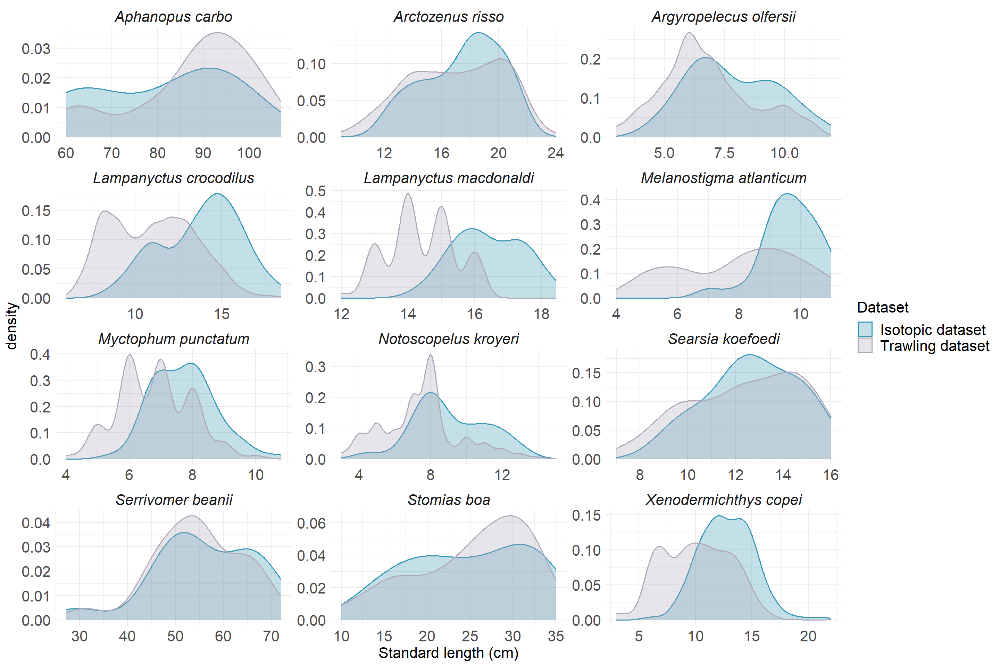

# 1. Size distribution as a function of depth

## Density plot by depth layer - community level

-   Bigger fish at depth ?

::: {.cell}
::: {.cell-output-display}
{width=672}
:::
:::

### Test of the significance of the size-depth relationship - community level

::: {.cell}
::: {.cell-output-display}
{width=672}
:::
:::

## Density plot by depth layer - species level

-  Only significant relationships (non-significant relationships in supplementary materials)

::: {.cell}
::: {.cell-output-display}
{width=1248}
:::
:::

# Linear relationships

::: {.cell}
::: {.cell-output-display}
{width=960}
:::
:::

# 2. $\delta$15N-size relationships

-   Sampling of some individuals to obtain $\delta$15N values

## At community level

-   Can we observe an increase in $\delta$15N values (proxy of trophic level) with increasing size of individuals in the deep pelagic fish community of the Bay of Biscay?

-   X axis (size) in log2

-   Significant increase but very small slope

::: {.cell}
::: {.cell-output-display}
{width=672}
:::
:::

## At species level

-   $\delta$15N axis standardized
-  __A__: significant relationships 
-  __B__: non-significant relationships 
-  __Coefficient of variation__: The dispersion of the $\delta$15N values is not the same between the species having shown non-significant $\delta$15N-size relationships: *X. copei* presents a strong dispersion of its values (CV = 6.57) contrary to the values of *N. kroyeri* which remain relatively stable with the size of its individuals (CV = 2.15)
-   Do these differences translate into differences in their feeding strategies?

::: {.cell}
::: {.cell-output-display}
{width=960}
:::
:::

# 4. Variation partitionning

-   At the species level, is it the sampling depth or the size of the individuals that most influences the values in $\delta$15N?
-  To test the significance of the influence of each variable (depth and size) on \(\delta\)$^{15}$N values an ANOVA-type permutation test was performed for each model (anova.cca function)
-  Since the third fraction is not the result of an RDA, it cannot be tested for significance.

## At community level

::: {.cell}
::: {.cell-output-display}
{width=576}
:::
:::

::: {.cell}

:::

::: {.cell}

:::

## *Lampanyctus crocodilus*

::: {.cell}
::: {.cell-output-display}
{width=576}
:::
:::

::: {.cell}

:::

::: {.cell}

:::

## *Myctophum punctatum*

::: {.cell}
::: {.cell-output-display}
{width=576}
:::
:::

::: {.cell}

:::

::: {.cell}

:::

## *Melanostigma atlanticum*

::: {.cell}
::: {.cell-output-display}
{width=576}
:::
:::

::: {.cell}

:::

::: {.cell}

:::

## *Serrivomer beanii*

::: {.cell}
::: {.cell-output-display}
{width=576}
:::
:::

::: {.cell}

:::

::: {.cell}

:::

## *Argyropelecus olfersii*

::: {.cell}
::: {.cell-output-display}
{width=576}
:::
:::

::: {.cell}

:::

::: {.cell}

:::

## *Lampanyctus macdonaldi*

::: {.cell}
::: {.cell-output-display}
{width=576}
:::
:::

::: {.cell}

:::

::: {.cell}

:::

## *Searsia koefoedi*

::: {.cell}
::: {.cell-output-display}
{width=576}
:::
:::

::: {.cell}

:::

::: {.cell}

:::

## *Notoscopelus kroyeri*

::: {.cell}
::: {.cell-output-display}
{width=576}
:::
:::

::: {.cell}

:::

::: {.cell}

:::

## *Xenodermichthys copei*

::: {.cell}
::: {.cell-output-display}
{width=576}
:::
:::

::: {.cell}

:::

::: {.cell}

:::

## *Arctozenus risso*

::: {.cell}
::: {.cell-output-display}
{width=576}
:::
:::

::: {.cell}

:::

::: {.cell}

:::

## Variance partitionning summary

::: {.cell}
::: {.cell-output-display}
{width=1248}
:::
:::

# 5. Summary table

**Testing significance:**

-   $\delta$15N - Size & $\delta$15N - depth : use of the anova.cca() function to test the significance of each part separately (depth & size) on the variability of $\delta$15N values
-   Depth - size : test with linear model lm (size\~depth)
-   *Stomias boa* & *Aphanopus carbo* \* depth range too small (\< 100m) so no use of variance partition models on these species, but linear models $\delta$15N - size significant

{width="70%"}

# 6. Limits

## Test of temporal variability on $\delta$15N values

-   Difficult to test because it is necessary to eliminate the biases due to size and depth.

-   However, over 90% of the sampling has been completed between 2019 and 2021 (and almost 3/4 in 2021)

-   If major environmental changes had occurred that significantly altered the baseline over time, this would have been observed in all species in the same way, which does not appear to be the case here

-   Test with *Lampnyctus crocodilus*: In the bathypelagic layer and individuals between 10 and 12cm : non signifiant differences

-   we can see that the data from the different years merge, there does not seem to be a strong effect of the year of sampling on the $\delta$15N values

 -   only night sampling

::: {.cell}
::: {.cell-output-display}
{width=1440}
:::
:::

## Representativeness of the sampling of individuals for $\delta$15N values

-   In supplementary material ?
-   no sampling of small *M. atlanticum* and big *L. macdonaldi*
-   but overall good sampling coverage over the size ranges of the species

::: {.cell}
::: {.cell-output-display}
{width=1440}
:::
:::

## Non-significant size-depth relationships at species level

::: {.cell}
::: {.cell-output-display}
{width=1536}
:::
:::
